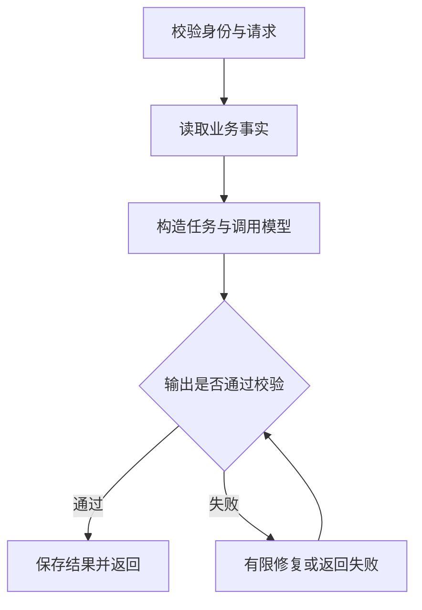

# 06 · 文本生成应用深化：从一次调用到可维护的后端服务

> 基于第06课的中文解读。「工程补充」为原创实践。核对日期：2026-10-03。下面的应用流程是设计说明，不是特定供应商的 SDK 使用教程。

## 1. 文本生成应用的本质

传统 API 的结果往往由确定的规则生成；语言模型 API 可以依据自然语言生成摘要、说明、改写和代码。因此新增的不只是一个 HTTP 请求，还包括如何描述任务、提供事实和判断输出是否可用。

例如生成商圈画像说明：数据库提供画像分布，程序完成排序与比例检查，模型把结果解释为业务人员读得懂的文字。模型不应该在没有数据时假造一组分布。

课程用菜谱生成器演示这一过程：用户提供原料，程序把原料和数量填入提示词，模型返回菜谱；再加入过滤条件和购物清单。这个案例的价值是展示动态输入如何进入任务，以及为什么输出仍需验证。

## 2. API 与 SDK 各负责什么

API 是请求与响应契约；SDK 是帮你构造请求、解析响应和处理部分错误的程序库。编排框架进一步管理提示词、工具和工作流。

| 层 | 作用 | 不会自动解决的问题 |
| --- | --- | --- |
| API | 与模型服务交换数据 | 业务口径和权限 |
| SDK | 减少调用代码 | 你的接口是否幂等、是否隔离租户 |
| 编排框架 | 组合多步任务 | 每一步是否应该执行 |
| 应用后端 | 业务规则、数据与状态 | 必须由你实现和验证 |

课程第06课在本次读取版本中已经使用 Responses 风格调用，并区分供应商模型名与 Azure 部署名。仓库中其他文件或旧笔记可能仍有不同接口；运行时应先检查文件实际采用的接口和依赖，而不是把不同版本示例拼在一起。

对接兼容接口时，URL 和 JSON 外形相同也不表示所有能力相同。文本、流式、工具、结构化输出和错误类型需要分别验证。不要仅因“兼容 OpenAI”就假定所有方法可用。

## 3. 一次请求应走哪些阶段〔工程补充〕



“有限修复”必须有次数上限；这张图不是允许无限重试。

**校验请求**：确认用户权限、字段类型、月份格式、输入长度。不要把无权限的数据发送给模型，再要求它不要透露。

**读取事实**：获取数据、来源版本和统计时间。读取失败要明确失败，不把空结果冒充“客流为零”。

**构造任务**：稳定规则由应用维护，动态资料每次填入。所有资料都应与当前请求关联。

**调用模型**：设置可用的输出预算和超时，记录请求状态。生成接口可出现限流、服务失败或网络中断。

**校验输出**：检查是否非空、是否符合契约、数字是否来自输入、是否存在材料外结论。只有格式合法不够。

**保存并返回**：明确区分完成、被取消、校验失败和调用失败。不能把任何字符串都包装为 success。

## 4. 菜谱案例揭示的两个错误

### 自然语言拼接可以改变含义

原课把过滤输入接到“no ...”后面，如果用户已经输入“no milk”，可能形成“no no milk”。自然语言模板也需要定义输入格式。

更稳妥的是把需求拆成结构化字段：

```json
{
  "available_ingredients": ["土豆", "胡萝卜"],
  "excluded_ingredients": ["牛奶"],
  "recipe_count": 3
}
```

先校验 count 是合理整数，再明确说明不得使用 excluded_ingredients。仍然不能只靠提示词来满足关键约束，输出需检查。

### 用户说“只用已有食材”和“生成购物清单”可能冲突

两种目标要明确区分：

- 严格只用已有食材：没有可行菜谱时说明限制。
- 允许新增食材：新增部分进入购物清单。

这类冲突不解决，模型可能给一个表面完整、实际不满足需求的答案。菜谱案例只是学习应用设计，不应将模型输出当作经过专业审核的饮食方案。

## 5. Token、长度与截断

输入内容和输出内容都影响资源消耗。可以用通用预算近似描述：

```text
任务规则 + 用户输入 + 资料 + 历史 + 输出预留 + 额外开销
≤ 该模型及接口允许的上下文预算
```

实际限制可能分别约束输入、输出或推理 Token，需要按使用的服务核对。“输出上限”不是保证能生成这么长，而是约束最大资源使用。

对于结构化结果，截断特别危险：JSON 最后一半缺失不能作为完整对象。应识别接口返回的未完成状态；不要只取一段文本就报告成功。

控制长度的顺序：删除无关资料、提取必要字段、减少冗余示例、压缩历史、合理设置输出预算。不要为了省 Token 删除统计时间、口径或权限相关信息。

## 6. 超时与重试〔工程补充〕

超时至少涉及应用整体期限和下游调用期限。下游调用期限应留出校验与返回时间。Go 服务可用请求 context 传递取消；Python 服务也应在请求取消后终止继续等待或重试。

重试前先区分错误：

| 错误 | 一般处理方向 |
| --- | --- |
| 输入参数不合法 | 修改请求，不重复原样调用 |
| 身份或权限错误 | 修复配置或权限 |
| 限流 | 遵守服务返回的等待信息，有限退避 |
| 临时服务错误 | 在总期限内有限重试 |
| 返回格式失败 | 记录错误，有限修复或明确失败 |
| 用户取消 | 停止任务，不能后台无休止继续 |

SDK 可能内置重试。如果 SDK 重试3次、应用再重试3次，实际调用会叠加。要审查每一层的重试规则。

超时不代表服务器未生成结果。再次调用可能增加费用。带工具副作用的任务还可能重复执行，因此模型生成重试与外部操作重试必须分别设计。

## 7. 输出校验示例〔可独立运行的原创代码〕

下面校验报告中返回的区域、月份、客流数值和摘要。它展示如何拒绝部分错误，不保证摘要所有语义都正确。

```python
import json

def validate_report(raw, expected):
    report = json.loads(raw)
    if not isinstance(report, dict):
        raise ValueError("报告必须是对象")

    fields = {"region_id", "month", "population_scale", "summary"}
    if set(report) != fields:
        raise ValueError("字段不符合契约")

    for key in ("region_id", "month", "population_scale"):
        if type(report[key]) is not type(expected[key]):
            raise ValueError(f"{key} 类型错误")
        if report[key] != expected[key]:
            raise ValueError(f"{key} 与数据源不一致")

    if not isinstance(report["summary"], str):
        raise ValueError("summary 必须是文本")
    if not report["summary"].strip() or len(report["summary"]) > 1000:
        raise ValueError("summary 为空或过长")
    return report
```

示例使用严格类型比较，避免 Python 中 True 与 1 比较相等造成误接受。真实业务还应验证分布比例、单位和来源，不只是 population_scale。

## 8. 流式输出改变的是交互方式

流式调用逐段返回内容，可以更早展示文字。首段到达快，不代表完整结果产生快。

如果内容需要整体校验，不应让前端把每个片段都当成最终事实。可将其标为生成中的预览，结束后再确认是否完成或撤销失败结果。

要分别处理“正常完成”“错误中断”“客户端断开”。流已经开始后，常常不能再像普通 HTTP 响应一样修改状态码，所以流协议本身需要传达错误与完成状态。

## 9. 观测与成本

至少记录 request_id、任务类型、模板版本、模型配置、耗时、结果状态与服务返回的用量信息。原始输入输出可能含敏感信息，记录前需要按业务规则脱敏或限制保留。

近似成本可以按“输入量 × 输入单价 + 输出量 × 输出单价”理解，但缓存、推理 Token、批量接口等可能使实际规则不同。本文不提供固定价格。

更有用的业务指标是“每次成功报告的成本”，它包含失败与重试成本。只比较单次调用的价格，可能选到失败率高、总成本更大的配置。

## 10. 练习

1. 请求月份缺失但模型返回当前月份，能接受吗？不能，除非产品契约明确默认月份且由应用补齐。
2. 模型返回合法 JSON 但数字不同，如何处理？报告校验失败，不自动用模型数字替换数据源。
3. 服务端超时后是否可以无限重试？不能，应考虑总期限、费用、取消和重复副作用。
4. 生成失败是否返回空报告加 success？不应如此，失败与无数据要有不同状态。

## 来源

- [原课程第06课](https://github.com/microsoft/generative-ai-for-beginners/blob/d8ec07e31c4b32bd283d565c1abd9b58bb5cf2e8/06-text-generation-apps/README.md)：API/SDK、文本生成、环境变量、菜谱生成器和输入参数。
- [课程概览](../06-text-generation-apps.md) · [深化笔记目录](README.md)
- 原课程 Copyright (c) Microsoft Corporation，MIT License；见 [LICENSE-Microsoft.txt](LICENSE-Microsoft.txt)。后端设计、业务示例和校验代码为原创补充。
