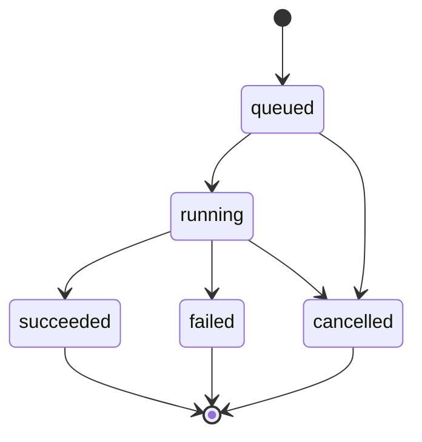

# 09 · 图像生成应用深化：需求表达、编辑、文件验证与异步交付

> 第09课深入解读，核对日期：2026-10-04。模型名称、参数与服务可用性按固定课程快照理解，不作为当前所有平台的能力承诺。「工程补充」为原创应用设计。

## 1. 图像生成解决什么问题

课程以教育项目为背景：从自然语言生成作业与学习材料中的插图。输入是视觉需求，输出是图像文件。编辑任务还会提供参考图片，有时提供蒙版。

它适合表达场景、人物、环境、风格和氛围。对于精确统计图、接口架构图和地图坐标，优先使用可核验的数据与绘图工具。即使生成图“看上去像图表”，也不能据此保证数字、标签和位置正确。

例如商圈推广插画可以使用生成图像；“某街区9月客流热力图”需要真实边界、坐标、统计值和明确的颜色刻度。

## 2. 不要把所有图像模型归成一种架构

原课程把 Transformer 和扩散式去噪放在一起简述生成机制。更稳妥的理解是：不同模型可能采用不同架构，具体内部实现需要模型发布者提供资料，不能从产品名称推断。

扩散式生成可概念性地理解为从噪声逐步得到符合条件的图像。自回归式生成则通过逐步预测表示来构造输出。这里是两种思路的说明，不是对某个闭源产品架构的断言。

对应用开发者，优先检查可用能力、输入契约、延迟、输出质量与编辑一致性，通常比猜测内部架构更有实际价值。

## 3. 图像提示词的六个组成部分

| 部分 | 作用 | 例子 |
| --- | --- | --- |
| 主体 | 画面核心 | 一个学习编程的学生 |
| 动作与关系 | 主体在做什么 | 在桌前查看屏幕 |
| 场景 | 地点与背景 | 安静的图书馆 |
| 构图 | 位置、留白、镜头 | 主体偏右，左侧留标题空间 |
| 视觉风格 | 材质与表现 | 平面插画、柔和配色 |
| 交付要求 | 比例、背景、用途 | 横版、用于课程封面 |

原创示例：

```text
为一门编程课程制作横版封面插画。
画面右侧是一位学生坐在书桌前看电脑，桌上有笔记本。
背景为简洁图书馆，柔和蓝绿色配色，平面插画风格。
左侧留出干净空间供后期排标题。
画面中不要生成文字、品牌标识或统计图。
```

“留白供后期排标题”能减少生成文字错误对交付的影响。精确字体、对齐、排版通常应在后期由代码或设计工具完成。

描述要一致。既要求纯白背景，又要求完整森林环境，需要明确是主体置于白色画布上的插画，还是森林场景照片。

## 4. 生成、编辑与蒙版是不同任务

**生成**从视觉描述创建新图。

**编辑**以已有图像为参考，提出修改要求，例如改背景或移动物体。应用要说明哪些对象和特征需要保留。

**蒙版**用于标识拟修改区域。其像素、透明度、尺寸和区域含义依接口规定，不应假定所有平台都把“白色”或“透明”解释成同一种操作。

一次编辑可能改变未指定区域或人物细节。不要把“只修改这块区域”当作像素级保真保证。需要对结果做视觉对比，特别是品牌资产、产品结构和角色一致性。

透明背景也要检查文件是否真的带有 Alpha 通道。棋盘格图案可能只是绘制在不透明图片上的背景，并不是透明。

## 5. 原课程代码到底做了什么

读取的 aoai-app.py 包含以下步骤：

1. 加载环境变量。
2. 创建 Azure 客户端并指定 API 版本。
3. 请求生成一张图。
4. 将响应转换成字典。
5. 取 data[0].b64_json。
6. 解码并保存到 images/generated-image.png。
7. 调用本地图像查看器。
8. 在 finally 中打印 completed。

这是一段单机教学脚本。它没有实现任务队列、租户隔离、下载权限和完整错误状态。

有几个直接可见的问题：

| 代码观察 | 风险 | 修正方向 |
| --- | --- | --- |
| 固定输出文件名 | 后一次覆盖前一次，并发任务相互干扰 | 服务端生成唯一对象键 |
| 假定 data[0] 和 b64_json 存在 | 空响应或结构变化时报错 | 验证结构与字段 |
| 文件扩展名固定为png | 输出格式变化可能与后缀不符 | 验证实际文件格式 |
| image.show() | 无图形界面的服务器不一定能显示 | 返回受控下载或预览 |
| finally 总打印 completed | 失败时也出现类似成功提示 | 区分结束与成功 |
| except 处理被注释 | 异常继续传播，没有应用层映射 | 记录失败原因并返回明确状态 |

finally 表示“无论成功或失败都运行”，不是成功分支。日志写“任务结束”可以成立，但产品不能据此设置 succeeded。

## 6. Base64 是编码，不是安全与格式保证

Base64 把二进制数据表示成文本；它不是加密，也不证明内容是一张图片。

解码后应检查：

- 是否满足最大文件字节数；
- 实际图像格式是否允许；
- 图像尺寸是否在范围内；
- 是否能完整解析；
- 是否符合内容与业务要求。

例如只接受 PNG 时，不能仅检查文件名以 .png 结尾。应通过解码库确认格式，并对尺寸设置上限，避免很小的压缩文件在解码后占用大量内存。

Base64 文本长度通常约为原始字节的4/3，另有填充和包装开销。若传输一张较大图片，不必在数据库里保存巨大的响应JSON；可以将图片保存为受控对象，数据库保存元数据。

## 7. 图像任务为什么适合异步接口〔工程补充〕

生成耗时可能比普通业务查询长。同步等待容易受到网关超时、客户端断线和重复提交影响。

一个异步任务可有下面状态：



取消要区分“停止展示或后续处理”和“供应商已取消计算”。客户端关闭页面不保证下游请求已经停止，也不保证不会计费。

建议把“提交任务”“查询状态”“获取结果”分开。任务成功必须意味着有效文件已保存且可被授权用户读取，而不只是供应商返回了HTTP成功。

## 8. 重试、幂等与文件写入

同一请求重试通常会产生不同图像，所以重试不是取回同一份结果。若用户因超时重复提交，可以通过客户端请求ID识别同一个逻辑任务。

幂等键只解决你自己的重复任务，不自动取消供应商侧重复计算。供应商是否支持幂等和请求恢复，需要单独确认。

保存文件时可以先写临时对象，验证通过后再发布最终引用。只有最终文件可读取时才更新成功状态，避免数据库报告成功但对象还没写完。

失败重试还应分类：参数错误先修正参数；临时服务错误在预算内重试；内容被拒绝需要解释或调整需求，不能无限原样重试。

## 9. Metaprompt 的价值和限制

课程用儿童插画规则作为上层说明，再拼接用户需求。它有助于表达用途、风格和内容边界，但不能保证每张图都符合要求。

应组合需求校验、平台过滤、结果检查与必要的人工审核。上层提示词不是权限系统，也不应把“Every image...”之类教学表达理解为绝对保证。

比例同样需要检查。提示词写16:9不代表实际输出文件一定是16:9；平台支持尺寸列表与提示词描述可能不同。最终应检查像素宽高，再决定裁切、留白或重新生成，并告知后处理造成的构图影响。

## 10. 结果怎么评估

图像质量不只看“好不好看”：

| 维度 | 检查什么 |
| --- | --- |
| 需求遵循 | 主体、动作、背景、数量是否正确 |
| 一致性 | 编辑前后关键对象是否保留 |
| 文件质量 | 尺寸、格式、透明通道与可解析性 |
| 可用性 | 留白、构图、屏幕展示与导出 |
| 文本准确性 | 必要文字是否有错字 |
| 业务准确性 | 是否画出不存在的产品结构或事实 |

如果要比较配置，应准备一组固定视觉需求，并使用相同评价规则。不能用不同提示词生成两张图，再把差异全部归因于模型。

## 11. 练习与参考答案

1. 生成结果返回Base64就能直接标记成功吗？不能，还需解码、文件验证、保存和访问检查。
2. 为什么服务器不应依赖image.show()？生产环境可能没有GUI，也不能把本地窗口当作用户交付。
3. finally打印completed后可以认为生成成功吗？不能，异常时也会执行。
4. 用户请求精确客流热力图应怎么办？使用真实统计与坐标绘图，生成模型最多辅助非精确的视觉素材。

## 来源

- [第09课正文](https://github.com/microsoft/generative-ai-for-beginners/blob/d8ec07e31c4b32bd283d565c1abd9b58bb5cf2e8/09-building-image-applications/README.md)
- [实际读取的Python脚本](https://github.com/microsoft/generative-ai-for-beginners/blob/d8ec07e31c4b32bd283d565c1abd9b58bb5cf2e8/09-building-image-applications/python/aoai-app.py)
- [第09课概览](../09-building-image-applications.md) · [深化目录](README.md)
- 原课程 Copyright (c) Microsoft Corporation，MIT License；见 [完整许可](LICENSE-Microsoft.txt)。本文没有执行付费图像生成或验证平台当前型号清单。
