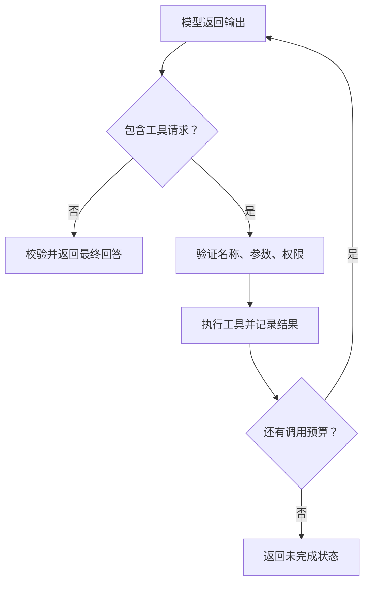

# 11 · Function Calling 深化：契约、工具执行循环、鉴权与失败恢复

> 第11课深入解读，核对日期：2026-10-04。基于固定课程正文和实际Notebook代码。「工程补充」为原创设计。本文的通用执行器不是特定供应商SDK教程。

## 1. 模型提出调用，应用决定执行

Function Calling让模型返回“建议调用哪个工具，以及参数是什么”。函数不会仅因为模型写出名称就自动执行；应用需要读取调用、验证请求、选择受控实现并执行。

例如用户说“查询 A 商场9月的工作人群”。模型可以建议get_profile，并生成地点、月份和人群参数。应用仍需要确认地点ID、具体年份、用户权限和工具是否可用。

这也解释了为什么它不只是“返回JSON”：JSON是数据格式，Function Calling还表达工具身份与调用关联。结构合法不代表动作已获授权。

## 2. 原课程的两个用途

课程先从学生描述提取结构化字段，再通过search_courses调用Microsoft Learn目录。

| 用途 | 结果怎么使用 | 关键校验 |
| --- | --- | --- |
| 结构化抽取 | 把自然语言转换为字段 | 缺失、类型、枚举和证据 |
| 外部数据查询 | 用参数调用受控API | 工具名、权限、参数和结果 |
| 有副作用动作 | 修改记录或发送消息 | 授权、幂等、结果状态 |

抽取信息不一定需要真正调用一个外部函数。若只是生成固定结构，可评估接口支持的结构化输出；若需要连接实际业务能力，再使用工具契约。

## 3. 一个调用包含哪些信息

课程示例的调用包含name、arguments和call_id。arguments在示例中是JSON字符串，应用需要解析；具体响应形态依SDK与接口而定。

- **name**：工具名，用于受控注册表匹配。
- **arguments**：建议参数，解析后仍是不可信输入。
- **call_id**：关联这一条工具请求与结果。
- **output**：实际执行结果，返回给模型供后续解释。

不要把call_id和幂等键混为一谈。前者关联一次模型输出里的调用，后者识别一个可重复提交的业务操作。模型再次生成同一动作时可能给出新的call_id。

## 4. 工具契约怎么设计

一个工具描述至少应说明：

1. 做什么、不做什么。
2. 何时应调用。
3. 参数含义、格式和枚举。
4. 缺项或歧义时如何处理。
5. 返回内容和错误类别。

原创的业务工具示例：

```json
{
  "name": "get_region_profile",
  "description": "查询已确认区域的指定月份聚合画像；不解析区域名称，不查询个人信息。",
  "parameters": {
    "type": "object",
    "properties": {
      "region_id": {"type": "string"},
      "month": {"type": "string", "description": "YYYY-MM"},
      "population_type": {
        "type": "string",
        "enum": ["resident", "work", "regular", "visitor"]
      }
    },
    "required": ["region_id", "month", "population_type"],
    "additionalProperties": false
  }
}
```

这是通用JSON Schema示意，不包含某供应商所需的完整外层封装，也未声明严格模式。运行前应检查所用平台支持的Schema子集。

“必填”只说明字段必须出现，不证明不是空字符串、不证明月份合法、不证明区域存在。服务端校验仍不可缺少。

## 5. 80多个API不一定要全部一次发给模型

工具描述会占用上下文，也会增加相似工具选择的难度。对于大规模API目录，可分阶段：

- 先按业务任务召回候选功能。
- 检查候选工具描述和适用范围。
- 只提供当前任务相关的少量工具。
- 执行时再验证权限和参数。

这是工程扩展，不意味着必须再调用一个模型做路由。固定分类、目录检索和规则都可能更适合。

目录应保存业务功能、正向条件、排除条件、参数依赖和返回口径。仅写“查询数据”不足以区分客流趋势、到访行为、画像分布和竞品共访排行。

候选召回失败应允许返回“没有匹配工具”，不能强制选择一个最相近接口。

## 6. 实际Notebook的契约问题

读取的oai-assignment.ipynb定义schema时只把role列为required，但Python函数search_courses(role, product, level)要求三个参数。模型合法地省略product或level，调用仍可能因缺少参数报错。

可选字段和函数默认值要一致。若三项必需，就在Schema和后端都要求；若某项可选，应明确默认值与调用行为。

同一Notebook还存在以下直接观察：

| 观察 | 后果 | 修正 |
| --- | --- | --- |
| requests.get没有显式timeout | 请求可能等待过久 | 下游超时与整体期限 |
| 直接读取json()["modules"] | HTTP错误或结构变化引发异常 | 状态与结构验证 |
| 返回str(results) | Python表示法不是稳定JSON契约 | 规范JSON序列化 |
| 只执行tool_calls[0] | 多个调用可能缺少对应结果 | 完整处理或限制调用数量 |
| 第二次调用仍允许auto工具 | 可能再次要求工具 | 受预算限制的循环 |
| 直接注册表取值 | 未知名称引发异常 | 明确拒绝未注册工具 |

课程正文中的示例则遍历tool_calls。正文和Notebook不完全相同，因此应针对自己运行的文件审查，不能只看正文就断言实现已覆盖多工具。

示例目录API返回的课程也不自动证明符合用户的全部条件；拿到列表后仍要核验筛选与相关性。

## 7. 通用执行循环〔工程补充〕



工具输出返回模型之前，要按调用ID关联。不能把A查询结果挂到B查询请求上。

循环必须限制轮数、总工具次数、整体耗时和费用。达到预算时应报告任务未完成，不能把空文本当成成功回答。

如果工具依赖前一步结果，比如先解析区域再查画像，就按依赖顺序执行。相互独立的只读查询可以并行，但仍需要逐个记录结果并处理部分失败。

## 8. 一个可运行的受控分派示例〔原创〕

下面不调用语言模型，也不访问真实数据库。它验证执行边界：只接受注册工具，身份来自服务端，区域与月份都经过检查。

```python
import json
import re

def execute_tool(name, raw_arguments, principal):
    if name != "get_region_profile":
        raise ValueError("未知工具")

    args = json.loads(raw_arguments)
    required = {"region_id", "month", "population_type"}
    if not isinstance(args, dict) or set(args) != required:
        raise ValueError("工具字段错误")
    if any(type(args[k]) is not str for k in required):
        raise ValueError("字段必须是字符串")
    if not re.fullmatch(r"[0-9]{4}-(0[1-9]|1[0-2])", args["month"]):
        raise ValueError("月份非法")
    if args["population_type"] not in {"resident", "work", "regular", "visitor"}:
        raise ValueError("人群类型非法")

    # principal由可信服务端身份层提供，不能来自模型参数。
    if args["region_id"] not in principal["allowed_regions"]:
        raise PermissionError("无区域访问权限")

    data = {
        ("example-A", "2026-09", "work"): 123
    }
    key = (args["region_id"], args["month"], args["population_type"])
    if key not in data:
        return {"status": "no_data", "data": None}

    return {
        "status": "ok",
        "data": {"population_scale": data[key]},
        "source": "fictional-fixture"
    }
```

示例权限集合是测试替身，不是完整身份系统。真实后端需要验证身份有效性、租户、区域存在性、数据范围、授权有效期和字段访问规则。

执行器不要使用eval、动态导入或把模型参数拼成shell命令。工具集合与实际函数映射由应用控制。

## 9. 为什么身份参数不该由模型决定

如果工具允许模型自由指定tenant_id或user_id，用户可以通过输入诱导模型选择另一个身份。后端不能把模型提供的“我是管理员”当作凭据。

身份、租户、权限和允许资源应由服务端会话或验证后的token确定。模型可以提业务参数，但不能扩大权限。

OAuth解决令牌与授权流中的一部分问题，业务服务仍需将token对应到实际用户、租户与资源权限。MCP提供工具协议，不替代这些检查。

## 10. 工具返回值也需要契约

建议区分ok、no_data、invalid_arguments、forbidden、temporary_failure等状态。不要把以下三件事都写成“没有数据”：

- 合法查询，业务系统没有记录。
- 无权查看记录。
- 查询系统故障。

模型可以解释no_data，但不能据此说人数为0。失败时不能使用模型常识填充业务数值。

结果还应保存来源、统计时间、单位和口径。超大返回值先裁剪或分页，不能让JSON被截断后仍传给模型当成完整证据。

工具返回文本属于外部资料，其中可能带有恶意指令。应用不能让它更改工具权限或任务规则。

## 11. 有副作用工具的幂等与重试

读取画像与发起支付、发邮件、修改记录有不同风险。动作授权来自用户任务和产品规则，不能只来自模型选择。

网络超时可能发生在“外部操作已完成，但结果没有返回”之后。重新执行就可能重复副作用。

可靠做法包括：

- 执行端接受并检查业务幂等键。
- 先查询已有执行状态，再决定重试。
- 记录参数、授权上下文与结果。
- 将模型生成重试与业务动作重试分开。
- 对不可确定的结果标为unknown或pending_reconciliation，而不是成功或失败二选一。

不能把“收到一个新的call_id”当作“这是新的业务操作”。

## 12. 如何评测工具链

分别测五个层次：

| 层次 | 示例指标 |
| --- | --- |
| 路由 | 选对业务工具的比例 |
| 参数 | 参数完整、合法、口径正确的比例 |
| 执行 | 正确工具真实完成的比例 |
| 回答 | 最终说明忠实于工具结果的比例 |
| 安全 | 未授权请求被阻止、未产生副作用 |

只测最终文字无法看出是否调用了错误接口。一个“答案合理”的测试样本，可能恰好被模型猜中。

测试应包含无匹配工具、缺参数、区域歧义、越权、多个调用、部分失败、空数据、无限循环倾向和重复提交。

## 13. 自查

- 模型返回工具名就能执行吗？不能，先验证注册、参数与权限。
- JSON解析成功意味着参数正确吗？不意味着。
- call_id能替代业务幂等键吗？不能。
- 工具失败后模型补一份猜测结果可以吗？不能冒充真实业务数据。
- 最终回答为空是完成吗？可能仍在等待工具或发生异常，需要检查状态。

## 来源

- [第11课正文](https://github.com/microsoft/generative-ai-for-beginners/blob/d8ec07e31c4b32bd283d565c1abd9b58bb5cf2e8/11-integrating-with-function-calling/README.md)
- [实际读取的Notebook](https://github.com/microsoft/generative-ai-for-beginners/blob/d8ec07e31c4b32bd283d565c1abd9b58bb5cf2e8/11-integrating-with-function-calling/python/oai-assignment.ipynb)
- [第11课概览](../11-integrating-with-function-calling.md) · [原代码审阅](../appendices/code-review.md) · [深化目录](README.md)
- 原课程 Copyright (c) Microsoft Corporation，MIT License；见 [完整许可](LICENSE-Microsoft.txt)。受控执行器与后端设计为原创补充。
