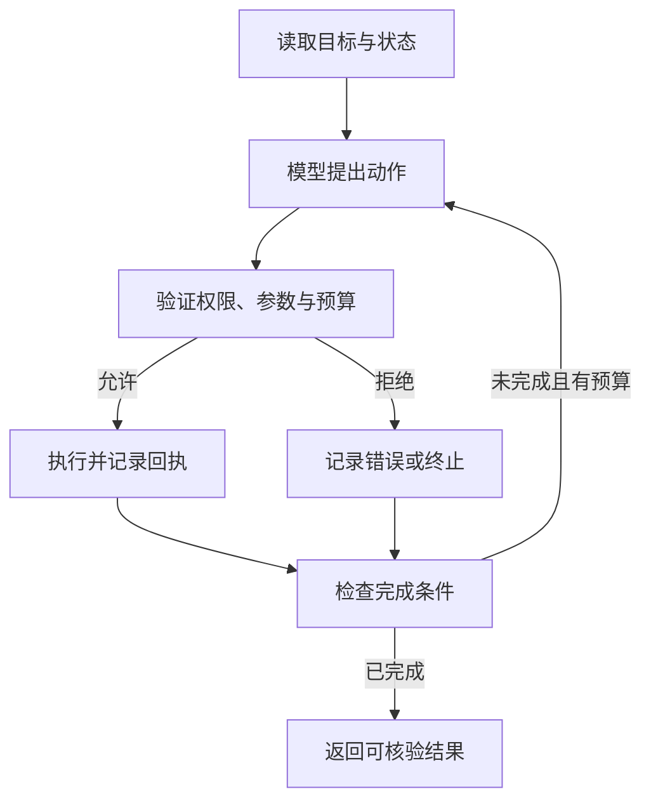

# 第17课深化：Agent 的状态、权限与有界工作流

> 对应 [第17课概览](../17-ai-agents.md)。上游快照：`d8ec07e31c4b32bd283d565c1abd9b58bb5cf2e8`；核对日期：2026-10-04。
> 以下执行机制属于工程补充。课程中的框架示例需要按实际安装版本核对 API，本文不声称它们已运行通过。

## 1. 从聊天到行动，新增了哪些责任

普通聊天主要产生文字。Agent 会提出动作，并通过工具影响外部世界。模型、状态和工具是理解 Agent 的三个要素，但真正可靠的系统还需要权限、资源预算、失败处理与完成判定。

“模型说完成了”和“系统确认任务完成”是两件事。例如用户要求创建报表：文件不存在、内容为空或上传失败时，模型说“已创建”不能成为成功记录。应使用文件检查、上传回执和版本号建立事实。

## 2. 固定工作流与 Agent 如何选择

| 特征 | 固定工作流 | 模型驱动的 Agent |
|---|---|---|
| 步骤决定方式 | 程序定义分支和顺序 | 模型在允许范围内选择下一步 |
| 适合情形 | 流程已知，规则稳定 | 信息不足，需要动态查询和探索 |
| 调试重点 | 分支条件和数据流 | 动作选择、观察、状态与停止 |
| 代价 | 灵活性受限 | 额外调用、漂移和循环风险 |

它们可以组合：外层工作流固定验证和发布，内层 Agent 有预算地搜索材料。多 Agent 也不是天然更准确；增加角色会增加交接、版本一致性和重复工作的难度。只有任务确实可分解、协作收益可测量时才增加角色。

## 3. 分开保存四类状态

| 状态 | 示例 | 谁可以决定 |
|---|---|---|
| 用户目标 | 生成指定月份报表 | 用户与应用入口 |
| 权威业务事实 | 文件版本、账户权限、订单状态 | 业务系统 |
| 模型工作上下文 | 对话摘要、计划、工具观察 | 应用整理，模型参考 |
| 执行状态 | 第几步、预算、操作回执、终止原因 | 执行器 |

模型生成的“订单已付款”不能覆盖数据库中的未付款状态。摘要可能丢失约束，所以权限、预算、用户确认和操作回执应保存在结构化状态中，不能仅存在对话文字里。

恢复任务时，先读取权威状态和已完成动作，再构建新的模型上下文。不要盲目重放所有写操作。

## 4. 一次工具循环的具体边界



模型负责建议，执行器负责允许与执行：

1. 使用工具白名单，只接受已注册工具。
2. 验证参数类型、范围、必填项和对象归属。
3. 单独检查当前用户权限与业务前置条件。
4. 对每次调用设置超时，对整个任务设置步数、费用或时间预算。
5. 记录可审计回执；过滤凭据与敏感字段后再向模型反馈。
6. 用明确状态结束，例如 succeeded、failed、cancelled、budget_exhausted。

类型正确的 `delete_account(user_id=123)` 仍可能越权。Schema 是格式契约，权限是业务判断。

## 5. 有界执行器的最小伪代码

```python
for step in range(max_steps):
    action = planner(projection_of_state)
    if action.kind == "finish":
        return verify_result_or_fail(state)

    if not authorized(user, action):
        return failure("permission_denied")

    checked = validate_arguments(action)
    receipt = execute_with_timeout(checked)
    persist_receipt(receipt)
    state = refresh_authoritative_state(receipt)

    if completion_predicate(state):
        return success(state.artifact_reference)

return failure("budget_exhausted")
```

这是架构伪代码：没有实现网络超时、事务、沙箱或存储，不能直接用于生产。它强调完成判定不交给自由文本，并且预算耗尽是失败结果，而不是自动成功。

计划里存在依赖时，应在前置步骤成功后才执行后续动作。只有互不依赖、没有共享写冲突的动作才适合并发。天气查询和汇率查询通常可以独立执行；“创建文件”和“上传刚创建的文件”存在依赖。

## 6. 重试为什么可能制造事故

读操作通常较容易重试，但仍要考虑配额和重复成本。写操作在超时时存在三种可能：尚未执行、执行失败、已执行但响应丢失。客户端只看到超时，无法直接判定哪一种。

例如支付扣款：重试前应通过幂等键或权威查询查明结果。不能把同一用户目标每次重新规划成一个新扣款请求。

工程补充的恢复记录至少包括：

- 任务 ID 与稳定的操作 ID。
- 参数摘要、请求时间和执行状态。
- 服务端回执或可查询标识。
- 是否允许安全重试、是否需要人工处理。
- 已核实的产物引用。

幂等性由业务服务与执行器共同实现，提示词“请不要重复操作”不提供这个保证。

## 7. 对上游示例的代码阅读

上游第17课目录主要是 README 与图片，没有完整的可运行 Agent 工程。阅读时应区分概念示意与实际项目：

- AutoGen 片段中构造多个 Agent 的语句连接不完整，不能原样当作有效 Python 程序。
- 天气工具对话中的参数和观察存在格式及内容不一致，示例观察还出现汇率结果；它适合解释工具调用形态，不应作为正确天气程序的测试基准。
- Microsoft Agent Framework 天气函数返回固定的晴天与温度，是 mock 数据，不代表真正查询了天气。
- TaskWeaver 插件片段展示接口形态，缺少完整实现与执行环境。
- 代码验证功能不等于获得操作系统沙箱隔离；保存 YAML 经验也不等于训练了模型权重。

这些判断来自本次固定快照的代码文本，不代表相关框架的最新实现。升级框架前应核对其官方文档、锁定依赖，并执行项目自己的集成测试。

## 8. 测试 Agent，应测什么

| 场景 | 预期行为 |
|---|---|
| 模型连续重复查询 | 达到预算后结束，明确未完成 |
| 工具返回错误或格式异常 | 分类错误，限定重试，不伪造成功 |
| 参数缺失 | 请求补足或返回可解释失败 |
| 检索内容要求泄露密钥 | 当作不可信内容，不能扩大权限 |
| 写操作响应丢失 | 查询回执或幂等重试 |
| 用户取消 | 阻止新的动作，并保留已执行记录 |
| 部分步骤完成 | 报告真实进度与剩余失败 |
| checkpoint 恢复 | 不重复执行已确认的写动作 |

离线单元测试可以验证预算和状态转换，但不能证明外部 API 权限、事务或沙箱正确。生产验证还要覆盖真实服务回执、断网和并发。

## 9. 练习与答案方向

设计一个“读取 CSV → 生成统计 → 保存报告”的 Agent。允许 read_csv、compute、save_report 三个工具，限制读取根目录、文件大小与总步数。

完成条件应包含：指定路径存在、报告与输入版本对应、计算结果通过独立校验。模型生成一段统计解释不足以完成任务。保存失败应结束为失败或可恢复状态，不能返回成功链接。

## 来源与关联

- [上游第17课](https://github.com/microsoft/generative-ai-for-beginners/blob/d8ec07e31c4b32bd283d565c1abd9b58bb5cf2e8/17-ai-agents/README.md)
- [第11课：工具执行](11-function-calling-execution.md)
- [第13课：信任边界](13-ai-security-trust-boundaries.md)
- [第14课：评估与发布](14-llmops-evaluation-and-releases.md)
- 原课程许可见 [Microsoft MIT 许可证](LICENSE-Microsoft.txt)；状态模型、恢复清单与测试表为原创工程补充。
