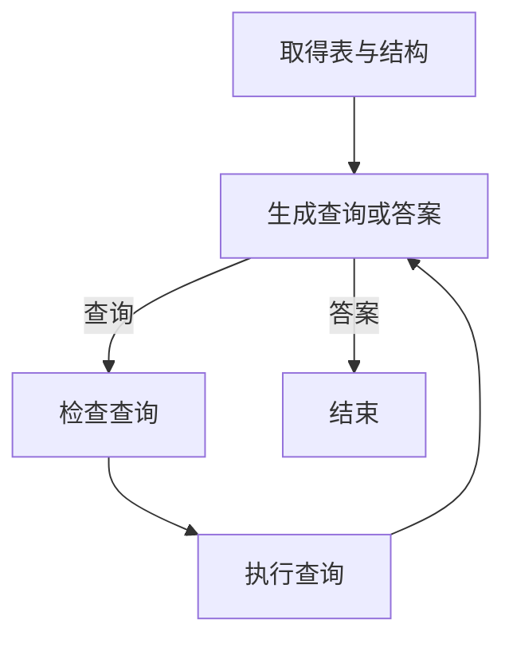

# LangGraph SQL Agent：把必经步骤写进流程图

核验日期：2026-10-04。证据级别：上游教程包含查询执行轨迹与结果；历史固定快照。当前示例已迁移。

## 1. 案例解决了什么问题

用户问“哪种音乐类型的平均曲目时长最长”，Agent 要从数据库找出答案。上游使用 Chinook 示例库，先看有哪些表，再取得 Genre 与 Track 的结构，生成聚合查询，检查后执行，最后依据结果回答。教程保留了工具轨迹与数据库返回值，这是比只写一段角色提示更具体的实现依据。

这里最值得学习的知识点是：**业务规定的必经步骤，可以成为图的边，而不是全靠模型记住。** 就像办业务必须先查档案再审批，表结构获取和查询检查是程序流程的一部分。

## 2. 代码里实际如何连接

教程同时演示预置 ReAct Agent 和自定义 StateGraph。自定义版本用 MessagesState 保存消息，使用 ToolNode 执行读表结构与查询。list_tables 节点主动构造工具调用，call_get_schema 节点仅向模型提供结构工具并强制选择工具。

生成查询后，条件边检查是否存在工具调用：存在则进入 check_query，再到 run_query；不存在则结束。查询执行结果回到 generate_query，模型可以修正错误或形成答案。因此它是一个有反馈的循环，并非一次性“自然语言转 SQL”。

图是本文简化表达；实际教程将表清单、结构请求与执行拆成多个节点。

## 3. 工程上为什么有效

模型只能在当前节点可用的工具中选择动作，执行次序受到程序约束。数据库错误成为下一轮可观察输入，模型不必凭空猜“是否执行成功”。查询检查提示覆盖 NULL、连接列、类型转换和范围等问题，但检查仍由模型完成，并不能代替确定性的权限控制。

注意教程的结束条件是没有工具调用，**不是独立验证业务口径已经正确**。即使 SQL 能执行，统计对象、时间范围、去重规则也可能错。重试上限、超时和结果校验属于实际落地需要增加的约束，不能说上游例子已经实现了这些保证。

## 4. 如何迁移到位置人群查询

教学改造：问题为“某区域近90天到访4S店的人群占比”。先解析区域、日期和人群类型；读取已登记的分子、分母定义，再选择允许查询的数据集。返回结构包含 population_scope、time_range、numerator、denominator、ratio、data_version，避免只返回一段百分比文字。

指标定义应由版本化业务配置提供，模型负责识别用户意图。SQL 执行账号只读，租户与对象范围由服务端绑定。禁止 DML 的提示不能替代数据库权限；LIMIT 只限制返回行数，也不保证聚合扫描便宜。大型表还需要分区条件、资源组或超时。

## 5. 怎么验证实现真的成功

用人工确认的问答集比较结果数值，而不只比较 SQL 字符串：等价 SQL 可以长得不同。分别记录口径匹配、权限拦截、查询执行成功、最终答案正确、耗时与重试次数。加入未知表、错误列、空结果、NULL 分母和越权对象测试。

[离线机制检查](examples/agent_case_checks.py)的 SQL 用例只演示 SQLite 只读限制，未加载 Chinook、未运行 LangGraph，也未验证模型自动生成查询。

## 6. 版本与练习

2026-10-04 核查当前仓库中的 examples/tutorials/sql-agent.ipynb，它已明确指向历史文档并声明目录不再更新。本篇按它提供的历史提交解读，API 片段不视为当前版本安装教程。迁移时以当前官方文档为准。

练习：查询执行成功但分母为空时，应该让模型编一个比例吗？不应。业务层应返回“无法计算”及具体原因。

## 开源来源

- [docs/docs/tutorials/sql/sql-agent.md](https://github.com/langchain-ai/langgraph/blob/23961cff61a42b52525f3b20b4094d8d2fba1744/docs/docs/tutorials/sql/sql-agent.md)

来源与许可见[快照清单](sources.md)。中文解释与业务改造由本知识库独立编写，不是官方逐字翻译；改造建议不表示上游已经实现。

[返回案例目录](README.md)
