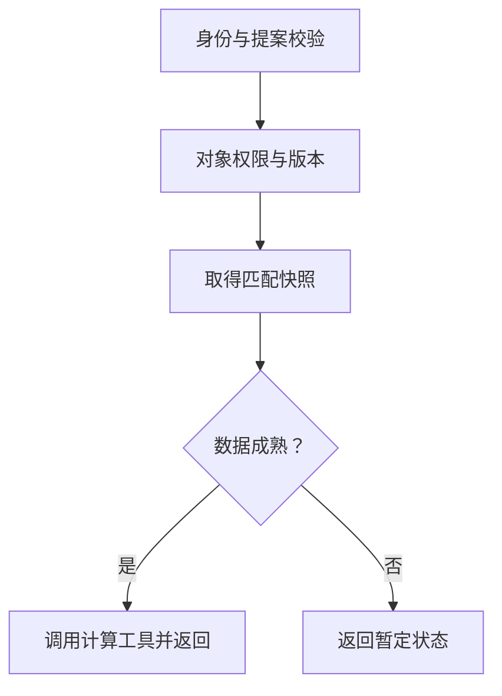

# API Agent业务集成：从结构化提案到真实HTTP结果

本篇把[区域业态占比](01-area-category-coverage.md)与[竞品共访](02-competitor-co-visitation.md)接成可运行HTTP服务。目标是验证后端如何约束Agent提案、取得授权数据并交付正确状态，不是证明模型已经能理解所有自然语言问题。

全部数据、对象和token均为公开虚构夹具。示例使用Python标准库，Python3.10及以上可阅读运行，本轮实测3.12.14；没有安装FastAPI或调用模型。FastAPI开源文档提供输入契约、依赖注入和接口测试的设计依据，标准库服务与业务逻辑由本知识库独立编写。Python的http.server仅用于本地教学，正式服务应使用项目已有框架与部署方案。

## 1. 一条请求怎样完成业务任务

假设用户问“这个区域本月多少人到访目标业态”。模型或规则解析器可以提出intent、对象、人群与日期；**提案只是输入，不能直接变成授权指令**。接口按下面的顺序执行：

1. 根据Authorization确定服务端Principal，不读取模型提供的tenant。
2. 校验请求字段、严格整数、日期窗口和支持的只读意图。
3. 核对对象权限与指标版本，再取得该身份下的数据快照。
4. 比较请求与快照的人群、窗口、集合定义版本和成熟度。
5. 调用对应计算工具，返回结果、依据、步骤和request_id。



这里是确定性编排器，尚未接自然语言解析模型、自主规划或模型生成解释。两个工具的调用路径按intent固定；模型未来只能提出支持的任务，不获得任意数据库或网络访问权限。

## 2. 请求契约是业务协议

接口为POST /v1/agent/query，接收JSON：

```json
{
  "intent": "category_coverage",
  "region_id": "area-alpha",
  "population_type": 4,
  "start": "2026-09-01",
  "end_exclusive": "2026-10-01",
  "metric_version": "coverage-v1",
  "max_tool_calls": 2
}
```

| 字段 | 约束与业务含义 |
|---|---|
| intent | category_coverage或co_visit；没有外发或写接口意图 |
| region_id | 稳定对象ID；必须属于服务端身份允许范围 |
| population_type | 严格整数1—4；本夹具只有4的快照 |
| start/end_exclusive | YYYY-MM-DD半开日期窗，至少1天、最多90天；结果注明Asia/Shanghai |
| metric_version | 业态占比coverage-v1；共访co-visit-v1 |
| competitor_id | 共访必需；业态占比不能携带无用竞品参数 |
| max_tool_calls | 严格整数1—3，默认2；每次工具调用前消耗预算 |

未知字段、缺字段、布尔值冒充整数和非法日期均被拒绝。tenant_id、凭据、SQL、数据版本等字段不接受模型注入。重复JSON键和NaN也被拒绝，避免一份请求在不同解析环节含义不同。

日期验证只证明输入合法，不证明数据可用。此处快照只覆盖2026-09-01到2026-10-01；换成其他合法窗口返回409，不会悄悄拿固定数据回答新日期。真实系统需要查询匹配范围，不能把本夹具日期写死到产品里。

## 3. 两个可复算业务结果

area-alpha人群为u1、u2、u3、u4，业态到访夹具为u2、重复u2、u4、域外u9。计算使用集合交集：分子2、分母4、ratio=0.5。HTTP状态200，业务status=ok；不返回原始用户列表。

共访提案改为intent=co_visit、metric_version=co-visit-v1并增加competitor_id=poi-rival。竞品人群为u2、u4：overlap=2，reference_share=0.5，competitor_share=1.0。两个方向不等同，不能把共享人群描述为客户流失。

结果context保存对象、人群、窗口、metric_version、population_definition_version和data_version。指标公式版本与源集合定义版本分开：即使公式未变，源集合的计算方法变化也会影响可比性。evidence中的快照版本与context必须一致。

正常请求trace含resolve_authorized_snapshot和相应计算工具。request_id每次独立生成。这是请求内可观察步骤，尚未持久化到Opik/Langfuse，也未实现跨请求恢复；错误返回当前只含错误码与request_id，没有完整错误步骤树。

## 4. HTTP成功与业务可用是两层

| 情况 | HTTP | 业务返回 | 已实测 |
|---|---|---|---|
| 正常占比/共访 | 200 | ok与结果 | 是 |
| 区域或竞品分母为空 | 200 | no_denominator，相关比例null | 是 |
| 数据未成熟 | 200 | provisional，result=null，不调用计算工具 | 是 |
| 无身份或演示身份无效 | 401 | UNAUTHENTICATED，带WWW-Authenticate: Bearer | 是 |
| 越权区域/竞品 | 403 | OBJECT_FORBIDDEN/COMPETITOR_FORBIDDEN | 是 |
| 字段、意图或日期不合法 | 422 | 具体校验错误 | 是 |
| 窗口、人群、指标或集合定义不匹配 | 409 | 对应MISMATCH错误 | 是 |
| 工具预算不足 | 429 | TOOL_BUDGET_EXCEEDED | 是 |
| 模拟数据源不可用 | 502 | UPSTREAM_UNAVAILABLE | 是 |
| JSON错误、重复键、NaN | 400 | INVALID_JSON | 是 |
| 非JSON或体积超过16KiB | 415/413 | 类型或体积错误 | 是 |

401在这里仅说明本地身份夹具无效，未实现OAuth发现、JWT验签、scope或token刷新。不能把一个Bearer字符串检查当作OAuth方案。429是本示例的任务预算错误，不是供应商限流，客户端应按error.code区分。

数据为0与数据缺失要分开。tenant-b的area-beta有1名用户且无人到访，比例0是合法结果；area-empty没有分母，比例为null。未成熟快照即使有数据，也不输出正式比例。

## 5. 本地启动与调用

在仓库根目录打开一个终端：

```bash
python knowledge/business-ai-cases/examples/api_agent_demo.py --port 8765
```

另一个终端执行：

```bash
curl http://127.0.0.1:8765/v1/agent/query \
  -H 'Authorization: Bearer demo-tenant-a' \
  -H 'Content-Type: application/json' \
  -d '{"intent":"category_coverage","region_id":"area-alpha","population_type":4,"start":"2026-09-01","end_exclusive":"2026-10-01","metric_version":"coverage-v1"}'
```

服务器只监听127.0.0.1，demo-tenant-a是源码公开的测试token，不能作为真实凭据或鉴权模板。Windows PowerShell可使用curl.exe并按其引号规则发送JSON，或直接运行下面的Python检查；示例curl采用POSIX shell写法。

## 6. 测试不直接跳过HTTP入口

运行：

```bash
python knowledge/business-ai-cases/examples/test_api_agent_demo.py
```

测试创建随机端口服务器，通过urllib发真实回环HTTP请求，再校验状态、响应、方向比例和步骤。23项检查全部通过，退出码0。包括两租户隔离、身份注入、严格类型、空竞品、不同合法窗口、错误快照版本及敏感原值不出现在响应中。

加--record会重新通过HTTP保存[五组结果](examples/api-agent-http-results.json)：占比、共访、空分母、未成熟、越权；为了结果可比较，记录文件剔除动态request_id，ID长度和唯一性由测试单独检查。

测试验证了本地HTTP→身份/输入校验→工具→业务结果。没有验证外部LLM、真实OAuth、真实数据库、生产租户权限、并发压力或经营效果；读取超时等代码分支也未全部故障注入，不称为完整覆盖。

## 7. 迁移到业务服务的四个接入点

**自然语言提案：**模型返回结构化任务，经同样的parse_query校验。歧义对象先调用授权解析工具；不把模型输出当作已验证事实。可以添加“需要澄清”状态，但本版接口没有实现。

**身份依赖：**把DemoService.authenticate替换为真实身份校验，Principal从可信上下文生成。FastAPI可用Depends，Go可用中间件和context；具体协议按项目规范验证。本篇不提供自制OAuth实现。

**数据适配器：**替换快照字典，读取服务端绑定的对象、人群和时间范围。后端只返回允许的汇总，集合去重在数据层完成；按真实数据协议记录完整性与成熟度。加入网络deadline、重试分类与资源限制，不能只限制模型步数。

**结果与可观测：**保留具体业务status、版本和证据，统一trace到实际观测平台。解释模板可以替换为模型，但所有数字与状态从结果取得；模型新增原因必须有额外证据。正式上线还需框架服务器、配置、权限与压力验证。

系统已有很多业务接口时，先按业务任务形成工具注册表及适配器，不急于给每个接口建立一个独立Agent。先让一个高频只读任务通过金标准，再增加更多意图和执行操作。写操作的幂等、审批与补偿不在本示例范围内。

## 来源与代码

2026-10-04重新读取FastAPI固定提交5f9fc5c59a9bb54608aa35376715f3ba9708188e：

- [请求体契约](https://github.com/fastapi/fastapi/blob/5f9fc5c59a9bb54608aa35376715f3ba9708188e/docs/en/docs/tutorial/body.md)
- [共享依赖与身份检查入口](https://github.com/fastapi/fastapi/blob/5f9fc5c59a9bb54608aa35376715f3ba9708188e/docs/en/docs/tutorial/dependencies/index.md)
- [接口级测试](https://github.com/fastapi/fastapi/blob/5f9fc5c59a9bb54608aa35376715f3ba9708188e/docs/en/docs/tutorial/testing.md)

FastAPI采用MIT；[完整许可](../agent-case-studies/licenses/fastapi.txt)与[来源清单](../agent-case-studies/sources.md)已保留。本文不是官方逐字翻译，也没有复用FastAPI实现；标准库服务和虚构业务设计由知识库独立编写。

[HTTP服务源码](examples/api_agent_demo.py) · [测试源码](examples/test_api_agent_demo.py) · [返回业务目录](README.md)

