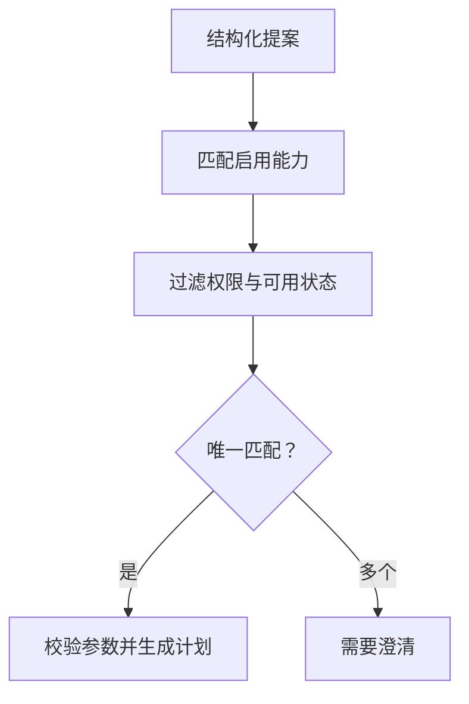

# 业务工具注册与任务路由：把多接口整理成可验收能力

接口多了以后，主要困难往往不是“能不能调用”，而是“这个问题应该调用谁、用什么口径、当前身份能不能用、结果还能不能解释”。本篇将[100项应用知识中的工具分组](../ai-application-playbook/02-tools-and-api-integration.md)与[规则路由](../ai-application-playbook/03-agent-routing-and-coordination.md)展开为可运行注册表，复用[上一篇HTTP示例](11-api-agent-http-integration.md)的两个业务适配器。

本例由知识库独立编写，采用Python标准库及公开虚构数据。它是确定性结构化任务路由，不调用LLM、不识别自然语言、不访问真实接口，也不是smolagents或FastAPI的集成示例。开源源码提供工具元数据与共享依赖的机制依据；业务分组、版本指纹和验收规则为本文设计。

## 1. 先整理业务任务，再整理HTTP路径

“查询客群”“区域统计”“到访分析”如果都作为工具名，模型很难区分。应该以可以交付的业务结果命名，比如“区域业态到访占比”“区域与竞品双向共访”。业务能力可以内部调用多个接口，一个底层接口也可能被多个能力复用。

| 层次 | 例子 | 负责什么 |
|---|---|---|
| 用户问题 | 这个区域多少人去过目标业态 | 业务目标，可能有歧义 |
| 结构化提案 | goal=coverage，object_type=region，parameters=明确对象与窗口 | 表达待校验意图 |
| 工具注册项 | region_category_coverage | 绑定适配器、版本、可用状态 |
| 业务适配器 | 固定意图category_coverage和coverage-v1 | 核对权限、快照与业务计算 |
| 底层接口 | 正式项目的人群与到访汇总接口 | 实际取数；本例使用字典夹具 |

第一步可以从现有接口清单选一个高频任务：列清输入、输出、数据权限、口径和失败情形，再决定哪些接口被封装进去。不要把“80个接口”简单转换为“80个Agent”，也不要为了工具数量少而把所有参数塞进万能查询入口。

## 2. 工具名、HTTP路径、业务意图是不同标识

工具名供能力选择，HTTP路径供网络访问，业务意图供适配器内部编排。改路径不一定改变业务语义，改分母却可能改变语义。三者应分别记录，避免旧工具名继续对应新口径而不留痕迹。

本例只注册两个工具：

| 工具名 | goal / object_type | 服务端绑定intent | 指标版本 |
|---|---|---|---|
| region_category_coverage | coverage / region | category_coverage | coverage-v1 |
| region_competitor_overlap | overlap / region | co_visit | co-visit-v1 |

模型未来提出goal和对象类型，注册表决定适配器常量。模型不能提交任意URL、SQL、intent、metric_version或tenant_id。本例也没有“未知能力就改调通用网络工具”的后备路径。

## 3. 元数据不是一段随意描述

ToolSpec记录name、goal、object_type、intent、metric_version、tool_version、enabled、available和effect。name唯一；enabled与available必须为严格布尔值；effect只允许read；意图与指标版本必须对应已经实现的适配器。注册重复名称、写工具或未知适配器时，启动阶段抛ValueError。

这里检查的是结构和允许的适配器绑定，不证明注册人员把业务标签写对了。把coverage标签错误绑定到另一合法适配器，仍需要业务契约审查与金标准题集发现。真实工具目录还应补中文说明、正反例、输入JSON Schema、输出协议、负责人、SLA与依赖清单；本版manifest仅为最小能力摘要，没有完整JSON Schema导出。

开源对照：smolagents固定提交的Tool.validate_arguments检查name、description、inputs和output_type等属性，并核对forward签名与inputs键。其output_schema注释明确说明只作信息用途，不执行实际输出校验。由此不能推断“有schema就已验证所有结果”；真实业务返回仍要单独检查。本文注册表没有复用该类。

## 4. enabled与available分开，避免误判

enabled表示此发布是否启用；available表示能力当前是否可用。前者通常是配置决策，后者可能来自健康检查或依赖状态。本例都是静态夹具标志，没有实时探测。

- 禁用能力不参与匹配，返回UNSUPPORTED_TASK。
- 已启用但身份没有权限，返回CAPABILITY_FORBIDDEN。
- 已授权却不可用，返回CAPABILITY_UNAVAILABLE。

不能把暂时不可用说成“不支持业务”，也不能在失败时偷偷换用语义不同的能力。正式产品是否向外区分“不存在”和“无权限”，应按信息披露策略设计；本教学错误码不代表生产系统必须暴露能力是否存在。

## 5. 先限制能力清单，再做对象授权

Access包含服务端Principal及tool_names。Registry.manifest只输出该身份已授权、已启用且可用的工具，按名称排序，不给模型发送其他工具描述。本例Access来自可信代码和公开演示token，不能接收客户端提供的权限列表；生产中应从已经验证的身份与权限系统构建。

能力权限与对象权限是两层。身份可以使用“区域占比”能力，但仍不能查询另一租户区域。Registry.plan检查工具权限，DemoService.execute进一步检查region_id及竞品范围。本例计划阶段不会查询业务对象，因此某计划能生成，并不表示对象已获授权；执行时仍可能OBJECT_FORBIDDEN。

这对应FastAPI依赖文档中的共享逻辑与身份检查思路：身份上下文作为服务端依赖传递，不在每个模型参数中重复。Go项目可以通过中间件与context实现类似分层；本文没有提供Go或FastAPI运行代码。

## 6. 无匹配、歧义与唯一匹配分别处理

本例只按精确goal和object_type匹配，流程为：



无匹配在B返回不支持；无权限和不可用在C返回相应错误。多个匹配返回NEEDS_CLARIFICATION，不按数组第一项、名称排序或模型自信程度决定。测试把候选顺序颠倒，仍要求澄清。

真实系统可以用业务条件消除歧义，如对象级别、时间粒度和结果定义；不能用技术接口名让用户盲选。本例没有实现澄清对话、候选检索或模型评分，也不声称解决了语义路由准确率。

## 7. 提案字段与执行字段分开

例子：

```json
{
  "goal": "coverage",
  "object_type": "region",
  "parameters": {
    "region_id": "area-alpha",
    "population_type": 4,
    "start": "2026-09-01",
    "end_exclusive": "2026-10-01"
  }
}
```

parameters只允许region_id、population_type、start、end_exclusive、competitor_id、max_tool_calls。注册表注入intent和metric_version后，继续调用上一篇parse_query；严格整数、日期半开窗口、必填竞品和工具预算依然适用。

验收时要同时检查两层：未知字段被拒绝；合法字段的业务值也被校验。只拦tenant_id而允许布尔值冒充人群类型，仍然会产生错误查询。仅通过参数校验也不代表数据快照覆盖窗口，执行时会继续检查。

## 8. 计划保存版本，执行重新检查

Plan保存catalog_revision、tool_name、tool_version、proposal_json和query_json。两个JSON通过排序键序列化复制，原提案后续被改动，不会悄悄改变已有计划。

catalog_revision为全部工具元数据按名称排序后计算的SHA-256。注册顺序变了，指纹不变；tool_version、状态或绑定版本变了，指纹改变，旧计划STALE_PLAN。执行还会在当前Access下重新路由，并比较计划字段；工具名、版本或执行参数被改动则PLAN_MISMATCH，权限撤销则CAPABILITY_FORBIDDEN。

这个指纹只绑定元数据，不自动检测适配器源码、权限数据库或数据变化。适配器代码变更应主动提升版本，源数据版本仍由业务结果记录。整目录指纹较保守：即使修改无关工具，也使旧计划失效；正式项目可按工具及依赖形成更细发布指纹，但要覆盖真实依赖。

Plan是进程内教学值，不是签名、审批凭证或可对外提交的执行授权。示例没有签名验真、审批存储、恢复日志或并发快照隔离；不能据此搭建直接信任外部计划的执行端点。真实执行应读取服务端保存的计划，并重新检查当前身份和业务条件。

## 9. 选择成功不等于业务成功

Registry.execute返回route与business两部分。route记录工具名、工具版本、目录指纹和exact_goal_and_object_type原因；business保留上一篇status、context、result、evidence和trace。

区域占比结果仍为2/4=50%；共访仍为2人，两个方向50%与100%。空分母仍是no_denominator，未成熟数据仍是provisional，不能因为工具选对就写成“分析完成”。这里只验证合成人群与固定日期，不提供真实经营因果或收益证明。

错误抛BusinessError，注册表脚本没有另建HTTP入口。若接入上一篇接口，应映射错误码与传输状态、补request_id；不能把内部异常直接当作模型自然语言回答。能力目录也不应把原始用户集合或身份凭据塞进工具描述。

## 10. 分别验收路由、参数、业务结果

一个问题回答错，可能是路由错、对象解析错、参数错、取数错、公式错，也可能只是解释错。生产评测应分别统计，避免一个总体正确率掩盖权限问题。

| 验收层 | 样例 | 本轮验证 |
|---|---|---|
| 注册配置 | 重名、未知适配器、写工具、非布尔状态 | 拒绝注册 |
| 能力选择 | 唯一、不支持、禁用、无权限、不可用、多匹配 | 精确结构化输入检查 |
| 参数 | 身份或URL注入、布尔整数、非法日期、缺竞品 | 拒绝计划 |
| 计划生命周期 | 修改原提案、参数篡改、版本改变、权限撤销 | 复制与重新校验 |
| 业务执行 | 50%占比、方向共访、对象越权、空分母、未成熟 | 复用合成数据适配器 |

测试共17项，2026-10-04在Python3.12.14运行全部通过。它们是离线边界检查，既不是17个真实客户案例，也不是17项HTTP测试。自然语言模型路由需要另外建立人工标注题集，包括歧义、别名、负例和权限分布，再测正确路由率、澄清率、错误调用及真实成本；本轮没有运行这一评测。

## 11. 运行与接入现有服务

在仓库根目录执行，Python3.10及以上、标准库即可；依赖上一篇api_agent_demo.py：

```bash
python knowledge/business-ai-cases/examples/tool_registry_demo.py
python knowledge/business-ai-cases/examples/test_tool_registry_demo.py
```

第一条输出两个业务结果；第二条运行17项检查并写入[结果记录](examples/tool-registry-results.json)。脚本不修改原HTTP服务，不依赖LLM、数据库或外部网络。

迁移时可以先将业务handler/service/dao分开：handler取得可信身份与结构化提案；service执行目录筛选、参数校验和业务编排；适配器通过既有dao或API客户端取数。目录负责人审查业务标签和口径，发布时提升版本；调用结果再送观测平台。不要为“工具化”绕过既有权限、数据质量或金额规则。

本例只读工具复用现有DemoService。写工具需要另建幂等、审批、回执与结果查询流程，可继续阅读[Agent应用工程](../agent-engineering/README.md)；不能只把effect改成write就获得执行安全性。

## 12. 来源、许可与验证边界

2026-10-04重新读取固定提交：

- [smolagents工具源码](https://github.com/huggingface/smolagents/blob/c30b115286e000e98711fae5e85993547b73d826/src/smolagents/tools.py)：Tool元数据、签名检查、validate_tool_arguments及output_schema的信息用途说明。采用Apache-2.0，[完整许可](../agent-case-studies/licenses/smolagents.txt)已保留。
- [FastAPI依赖文档](https://github.com/fastapi/fastapi/blob/5f9fc5c59a9bb54608aa35376715f3ba9708188e/docs/en/docs/tutorial/dependencies/index.md)：共享逻辑、资源与身份检查作为依赖。采用MIT，[完整许可](../agent-case-studies/licenses/fastapi.txt)已保留。

本文为独立中文讲解，没有复制上游实现，没有安装运行这两个框架，不把上游功能当作本例已实现能力。[机器可读来源与验证记录](examples/tool-registry-sources.json)保存读取路径和范围。

[注册表源码](examples/tool_registry_demo.py) · [检查源码](examples/test_tool_registry_demo.py) · [返回业务目录](README.md)
