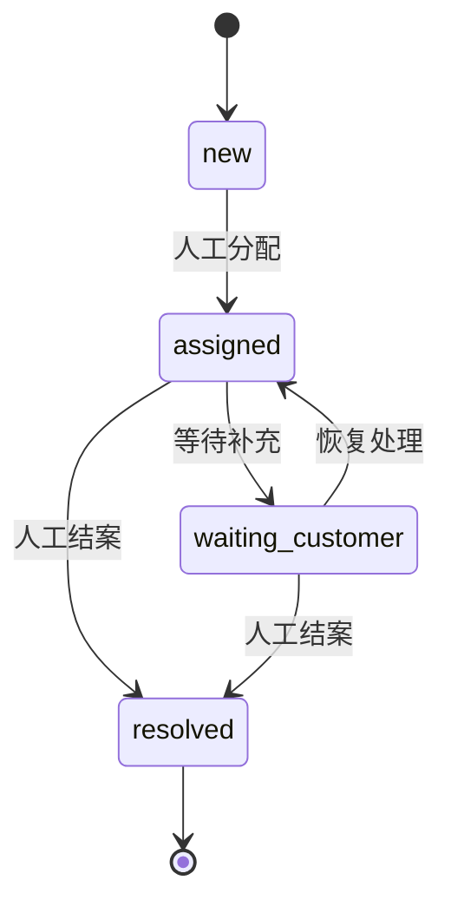

# 客服工单落地：重复请求、状态流转、响应时限与人工接管

客户反馈“区域数据还没更新”，Agent判断应交给数据团队，这只是路由建议。真正的业务交付还要回答：工单有没有写入成功、同一次重试是否重复建单、谁正在处理、多久没有有效响应、能否结案。

本篇接续[客服分类与路由](07-customer-support-ticket-routing.md)，用一个独立SQLite程序演示工单写入与生命周期，适合SaaS客服、数据问题反馈和内部支持助手。全部租户、工单与时限虚构；不代表现有产品功能、合同SLA或真实客户案例。

## 1. 区分模型转接与业务工单

模型的handoff表示“接下来由另一个Agent继续处理对话”。工单是支持系统中的业务对象，拥有稳定ID、当前状态、责任队列和操作记录。两者可以关联，但任何一次模型转接都不能直接当成工单创建成功。

[OpenAI Agents客服示例](https://github.com/openai/openai-agents-python/blob/81f0ccf20c6e24063b9da36fa37f2bdb6a43d8d3/examples/customer_service/main.py)展示FAQ Agent、座位处理Agent、分流Agent及共享上下文，也会区分handoff和工具输出。示例中的座位工具更新上下文，并没有连接真实航空订座系统。本文借鉴其职责分流与上下文传递思路，工单账本与规则为独立业务设计。

正式客服流程可以让模型整理类别、影响范围和待确认信息，后端依据授权与政策建立工单，再根据实际回执回复客户。没有真实写入回执时，只能说“已整理问题”，不能说“工单已创建”。

## 2. 只保存完成业务所需的最小字段

| 字段 | 教学值 | 用途 |
|---|---|---|
| tenant | a | 将读写限定在租户范围 |
| id | 1 | 工单稳定ID |
| category / priority | data / p1 | 分类与示例响应目标 |
| state / queue | new / data-support | 当前阶段和负责队列 |
| version | 1 | 检测旧页面或旧Agent计划 |
| created_at / due_at | 100 / 160 | 连续时间下的首次响应检查 |
| first_response_at | 空 | 区分分配与有效响应 |
| escalated | 0 | 避免同一规则反复升级 |
| resolution_ref | 空 | 人工结案依据标识 |

生产还应保存客户问题、授权业务对象、来源渠道、负责人、政策版本和审计操作者。本文为简化检查没有存储问题正文或操作人ID，不能直接当作完整审计系统。

不要默认把客户上传的完整数据、访问密钥或个人明细送给模型。工单中可以先保存业务对象ID、请求ID与错误现象，必要的诊断资料在受控服务中查询。

## 3. 用业务请求键防止同一次操作重复写入

创建接口已成功提交，但客户端没有收到响应，通常会重试。同一次创建应沿用同一个`request_key`，不能每重试一次就产生一个新键。

示例`receipts`表以`(tenant, request_key)`为主键，同时记录请求指纹和原始业务回执。相同键、相同请求返回原回执；相同键、不同类别或优先级返回冲突，不能悄悄复用另一张工单。

指纹由明确的业务参数生成，不含调用时间。因此在100时创建、120时重试仍被识别为同一次请求。动作指纹包含工单ID、动作、预期版本和结案依据，避免把一次“分配”重试误当作一次“结案”。

教学键在一个租户内同时覆盖创建与后续动作；每个不同业务动作都应使用新的键。真实服务要限制键长度、设置回执保留策略，并明确超过保留期后的重试行为。本文回执不自动过期，不实现清理。

## 4. 幂等重试与相似投诉合并分别处理

同请求键重试是确定性重复，可以自动返回回执。客户今天投诉“数据没更新”，明天又说“怎么还是旧数据”，可能是同一问题，也可能是另一批对象或另一天的数据故障。

不能仅凭文本向量相似就自动合并。建议检查租户、产品、业务对象、数据日期、故障类型和已有工单是否仍在处理，再向客服展示候选，由规则或人工确认合并。合并后也要保留原渠道事件，防止用户的新增证据被吞掉。

本文只实现请求级幂等，不实现跨渠道相似投诉识别、语义合并、父子工单或事件聚类。新请求键会创建新工单，即使类别相同。

## 5. 把状态变更限制在允许的路径

示例的状态只有四种：

| 当前状态 | 允许动作 | 下一状态 |
|---|---|---|
| new | assign | assigned |
| assigned | respond | assigned，并记录首次响应 |
| assigned | wait_customer | waiting_customer |
| waiting_customer | resume | assigned |
| assigned / waiting_customer | resolve | resolved |
| resolved | 无 | 终态 |

自动程序可以创建和到期升级，分配、响应、等待、恢复与结案都要求人工角色夹具。这是本文保守的教学政策，不是所有客服系统的统一要求。真实平台可允许部分自动响应，但要建立可信的“有效响应”定义和审核机制。



`respond`不改变状态，只写首次响应时间。示例没有“重新打开”动作；客户再次反馈需要另外定义reopen政策，不能绕过状态机直接改数据库。

## 6. 用版本号阻止旧计划覆盖新处理

两名客服同时打开version=2的工单。甲先发送有效响应，版本更新为3；乙依据旧页面要求转为等待客户。若乙没有重新读取，后端应拒绝其`expected_version=2`，避免覆盖甲刚做的更新。

每次成功动作和到期升级都会增加version。操作要求提交预期版本，在事务内核对当前版本再写入。因此升级到人工队列后，之前生成的操作计划也需要重新确认。

这里的冲突可以通过重新读取与重新决策解决，不能直接把版本号换成最新版后盲目重试同一动作。人工变更可能改变操作前提，例如工单已结案或客户已经补充资料。

## 7. 在同一事务内保存对象、事件与回执

示例采用SQLite的`BEGIN IMMEDIATE`事务：确认请求回执、校验当前对象、修改工单、增加事件、保存结果回执，最后一起提交。任一步抛出错误都会回滚。

若工单写入成功但回执没保存，同请求重试可能再创建；若先保存成功回执却没更新工单，用户会看到并不存在的成功状态。因此这几个本地写入必须具有一致的提交边界。

本轮有一个真实并发检查：两个线程各建独立SQLite连接，同一时刻使用相同请求键创建，得到同一个工单ID，一次创建、一次回放。另有临时文件关闭/重开连接检查，确认本地提交的工单与回执可以重新读取。

这不证明分布式部署或生产吞吐能力。SQLite存在单写者限制，正式数据库应使用相应事务、唯一约束和并发更新条件，并测试锁超时与连接失败。本文未测试磁盘故障、掉电、跨主机或备份恢复。

## 8. 首次有效响应不能用“已分配”替代

将工单分配给数据团队，只说明有人负责；客户尚未收到有效答复。示例只由`respond`动作首次写入`first_response_at`，后续响应不会把这个时间改成更晚的值。

本文p1目标为60个时间单位、p2为300，纯为测试边界设计。当前时间达到`due_at`且没有首次响应时进入升级队列。它不是营业时间SLA，也没有节假日、客户合同、暂停计时或服务等级策略。

示例使用可信服务传入的非负整数时间。同一工单的新事件不得早于最后事件；动作重试回放不新增事件。生产时间应由后端绑定，不能让模型填一个较早时间掩盖超时。生产还要区分事件发生时间和记录时间，处理时钟偏差。

`wait_customer`不会暂停首次响应计时。这样即使工单被标成等待客户，但从未执行有效响应，仍然会升级。正式平台应规定“发出补充信息请求”是否算有效响应；仅在内部分配或改状态不能自动算作响应。

## 9. 升级改变责任队列，不等于已经通知人员

`escalate_due`只扫描指定租户中未结案、未响应、未升级且已到期的工单，设置`queue=human-escalation`、增加版本并写升级事件。再次扫描不会重复升级。已有有效响应的工单不会因这条首次响应规则再升级。

这种一次性规则还需要更完整的业务政策：人工队列无人接单多久再升级、重复故障如何进入事件管理、解决时限如何计算。它们不是当前示例已经实现的功能。

程序没有发送邮件、消息或外部Webhook。正式平台若需要通知，应将待通知事件与工单更新放在同一事务内，再由独立发送器消费；接收方用事件ID去重。数据库队列已经改变，不代表通知已送达，更不代表人工已经接管。

## 10. 回执回放与当前状态各有用途

重试一次旧“分配”动作，会返回当时version=2的原始回执，即使工单后来已经处理到version=3。示例明确附`replayed=true`，表示原动作成功的证明，并不表示对象当前状态。

面向客户的进度页面应另外查询当前工单，避免用旧回执说“仍在分配中”。工具输出建议同时区分操作回执与最新对象版本；模型解释也要遵循这个区别。

示例`get`读取的是当前租户范围内的对象，但租户与`human`均为可信夹具参数，没有实际登录认证。生产必须由鉴权中间件绑定，不允许模型或外部调用者自己声明人工身份与租户。本文没有细分“可分配”和“可结案”等权限，也没有权限撤销测试。

## 11. 结案依据需要继续核查

人工结案要求非空`resolution_ref`，例如对应恢复验证记录。这个条件防止完全无记录结案，却不能证明引用真实存在，也不能证明问题已经恢复。

数据延迟工单的真实结案可以要求：指定数据日期已更新、对象查询成功、质量检查满足约定，再附验证时间和检查结果。解释类工单则可以引用有效的指标定义及客户确认。不同类别需要各自的结案规则。

本文不实现来源核验、客户确认或自动修复；`resolved`表示教学状态机接受了人工结案动作。模型不能把它扩写成“已验证所有系统恢复”。同样，发送一条响应不代表回复内容一定正确，程序没有存储或评测响应正文。

## 12. 运行、验收与业务试点

```bash
python knowledge/business-ai-cases/examples/support_ticket_demo.py
python knowledge/business-ai-cases/examples/test_support_ticket_demo.py
```

[源码](examples/support_ticket_demo.py)使用Python标准库与本地SQLite。2026-10-05在Python3.12.14运行[24项检查](examples/test_support_ticket_demo.py)，全部通过；覆盖键冲突、租户隔离、人工动作限制、旧版本、非法状态回滚、原始回执、计时边界、单次升级、等待恢复、结案依据、本地文件重开和两个连接的重复写入。[运行记录](examples/support-ticket-results.json)保存创建、重试、升级、分配、响应与结案的输出。[固定来源](examples/support-ticket-sources.json)说明上游学习范围；[上游MIT许可](../agent-case-studies/licenses/openai-agents-python.txt)已保留。

这些检查没有调用模型、真实客服平台、认证服务、通知系统或生产数据库，也没有验证合同SLA。示例中的分类与优先级已结构化输入，自然语言分类准确性未评测。

试点先使用已授权历史样本，人工标注期望类别、是否同一请求、升级条件和可否结案。分别衡量重复建单率、无有效响应的超时率、错队列率、旧状态误报和错误结案率。再比较整个处理流程的人力核查成本，不只看模型回复速度。

练习：为“客户补充资料”增加一条独立事件，保留原问题并增加工单版本；再设计等待期间的解决时限政策。先列出状态和计时边界测试，再接到真实工单服务。不要因为这份教学代码通过，就跳过真实身份、权限与通知验证。

[返回业务案例目录](README.md) · [返回总入口](../../README.md)
