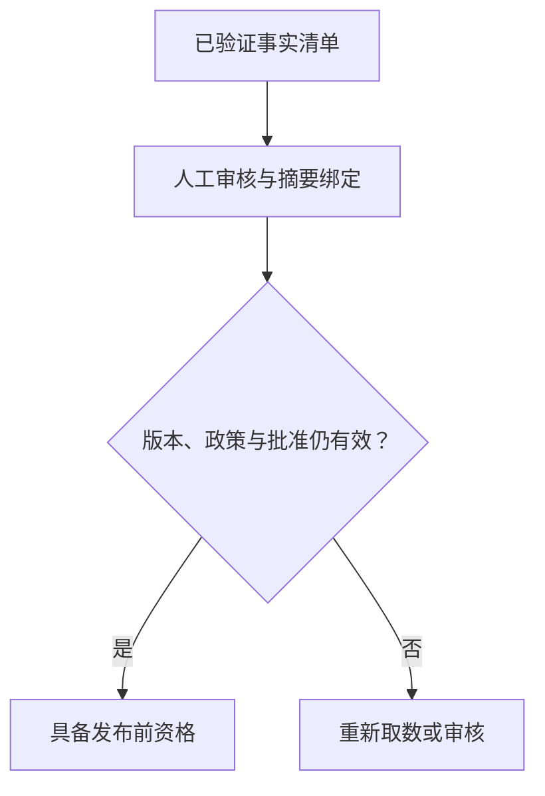

# 经营报告交付：事实清单、版本绑定与发布前验收

运营希望每月拿到“区域触达、竞品共访、客流变化”摘要。报告生成很快，却可能把八月共访和九月客流拼在一起，或者沿用数据修订前已经批准的旧稿。业务需要的交付物应同时说明数字、口径、出处、缺失项与审核版本。

本篇接续[经营报告与证据](08-business-report-evidence.md)，以可复算的结构化事实清单演示发布前验收，适合运营月报、客户分析简报、选址调研摘要和管理看板解读。全部业务对象、数据、审核人和证据ID虚构；不代表已上线报告系统或实际收益。

## 1. 先约定报告必须回答什么

“写一份经营分析”过于宽泛。建议在模板中明确必答项、范围、截止时间和交付限制。例如必须回答以下三项：

| 必答项 | 指标含义 | 教学计算 |
|---|---|---|
| coverage | 指定对象人群中触达目标业态的比例 | 50 / 100 = 0.5 |
| co_visit | 指定方向人群与竞品共访的比例 | 30 / 100 = 0.3 |
| traffic_change | 已匹配口径的当前量相对基准量变化 | 90 / 100 − 1 = −0.1 |

每项要有版本化业务定义。共访方向、触达范围、客流去重和趋势日型都需要上游先确定，不能由写作模型临时补充。本文只接收已经聚合好的教学计数，没有实现原始轨迹去重、竞品集合构建或同日型匹配。

模板也要约定哪些内容不能自动推导：例如营销导致客流下降、调整预算会提高收入、推荐门店必然盈利。这类因果或收益结论需要另外的证据与方法，不属于上述三项统计事实。

## 2. 从“长文章”转为“事实清单加表达层”

事实清单相当于报告的账本。先把每条必答指标的值、状态、证据和数据版本保存下来，再根据这些材料组织文字、图表与附件。

建议拆成四步：版本化模板确定必答项；授权工具取数；确定性检查形成事实清单；写作模型生成草稿。生成后的全文还要检查新增事实、条件遗漏与引文支持，最后由审批和发布流程交付。

本文仅实现事实清单与审批夹具。没有生成文章、图表、PDF或邮件。把`ready_for_review`理解成“结构化事实满足本示例规则”，不能理解成整份自然语言报告已审核通过。

## 3. 对象、窗口与口径必须一致

一条教学指标包含`name、object_id、period、definition、data_version、numerator、denominator、mature、evidence_id`。报告范围固定为`area-demo`和`[2026-09-01, 2026-10-01)`；结束日期不包含。

检查器逐项核对对象、窗口和对应指标定义。任何一项不一致都拒绝生成清单，而不是把错误指标作为正常结果拼进去。缺指标则保留缺失节，便于区分“没有结果”和“结果与需求不一致”。

业务窗口一致不意味着源数据一定来自同一张表或同一个版本。触达、共访与趋势各有数据版本是正常的；需要记录各版本对应的范围和取数快照。本文没有真实来源数据库，信任手工定义的夹具。

趋势的基准窗口可以与当前窗口不同，但比较设计须绑定在该指标口径或上游回执里。示例把这件事简化为`matched-day-1`定义及已聚合90/100，未核验真实基准日期、完整日型或数据成熟日。

## 4. 数值检查不能只看有没有数字

计数必须为非负整数，布尔值不能当作1或0。对于触达与方向共访，分子应不大于分母；对于变化率，当前量可以大于基准量。

程序使用Decimal计算，输出比例字符串`0.5、0.3、-0.1`。展示层若转换为百分比，需要乘100并标成50%、30%、−10%；不要把0.5写成0.5%。本文没有格式化完整展示报告。

当分母为0时，结果为`undefined`且值为空，不写0%。0%表示有可比较的基数且分子为0，不能用它替代没有基数。计数合法也不证明样本无偏、源数据完整或业务统计准确，这些问题应由数据质量服务和实际评测回答。

## 5. 把缺失、未成熟和可审核分别表达

| 指标状态 | 意义 | 对报告交付的影响 |
|---|---|---|
| ok | 本示例口径、计数、证据字段和成熟度检查通过 | 可以进入结构化清单审核 |
| missing | 必答指标尚未取得 | 保留缺失项，报告为partial |
| provisional | 有合法计数，但数据未成熟 | 只作暂定结果，报告为partial |
| undefined | 分母为0，比例或变化率不可计算 | 说明不可计算，报告为partial |

全部必答项为ok时报告是`ready_for_review`，否则为`partial`。本文的批准流程只接受前者。这是保守教学政策；真实业务可以允许发布带明确限制的部分报告，但应使用不同模板和审批规则，不能让模型自己删除缺失项后宣称完整。

没有结果的原因应另外记录：权限不足、数据未生成、服务失败、空样本和字段不支持各有不同后续动作。示例只保留missing，不分类这些来源原因。

## 6. 每条事实单独关联证据

示例为三项指标分别设置`receipt-coverage、receipt-co、receipt-trend`。每个指标同时携带自己的`data_version`，避免拿一份“总体查询成功”回执证明所有章节都正确。

本示例要求每个指标使用独立证据ID，并拒绝重复引用。实际平台可以让一份批量回执支持多个指标，但必须提供字段路径或证据子项ID。不能直接把本文的“一项一ID”约束当作所有报告系统的通用规则。

程序只检查证据ID非空与不重复，没有验证来源存在、内容哈希、访问权限或证据是否真的支持结论。真实系统应从受控证据服务取得回执，并参照[结果协议](17-business-result-contract.md)绑定对象、窗口、口径和数据版本；这两份教学代码尚未集成。

## 7. 哈希绑定具体清单，避免审核对象漂移

报告正文包含租户、对象、窗口、规则版本、必答项、指标定义和事实章节。程序使用确定的JSON序列化方式，对这些内容计算SHA-256摘要。必答项排序后保存，避免同一组指标因为输入顺序不同产生不同摘要。

批准记录保存`digest`，表示审核对应这一份具体清单。审核后更改数字、必答项、窗口或规则版本，原批准不能继续使用。

哈希只说明内容是否变化，不证明批准来源合法。示例批准记录是可构造的字典，没有数字签名、真实身份认证或持久审计。生产应将批准保存于受控审批服务，发布服务按批准ID读取并核验审核权限，而不是相信外部传入的“已批准”字段。

程序也会根据可信夹具重新生成清单并比对，因此篡改数字后重新计算哈希仍会失败。这个校验依赖服务内夹具可信；攻击者能修改服务端事实时，单纯再算一遍不能提供真实性保证。

## 8. 数据修订与规则变更会使旧批准失效

假设报告使用`coverage-data-2`取得50/100，随后数据团队修订为`coverage-data-3`。即使原清单没有被编辑，发布前核对当前数据版本时也应发现变化，重新取数、计算和审核。

`check_release`要求当前版本映射与稿件各指标版本完全一致。映射缺指标也拒绝放行，而不是假设未知来源版本没有改变。检查还要求当前发布政策与清单的`policy_version`一致。

实际数据版本应该绑定完整依赖快照。若触达指标依赖人群快照与POI业态库，两个依赖变化都应反映到版本或依赖清单里。本文只是每项一个字符串，不管理多源版本向量。版本字符串不变却实际数据被替换，也超出本例的检测能力。

## 9. 批准到期与实际发布仍是不同步骤

示例批准的有效区间是`[approved_at, expires_at)`。未到批准时间或达到结束时间都不能通过检查。100到200是虚构整数时间，生产时间应由可信服务绑定，不能允许模型修改时钟。



返回`eligible_for_release`只说明本示例检查通过。实际发布还要核对收件人或渠道权限、最终产物摘要、发送幂等键和发送回执。程序没有发送任何消息或发布任何真实报告。

检查通过与实际发送之间仍可能发生数据或权限变化。真实实现应保存发布所使用的快照和产物，必要时在正式发布事务或受控任务中再次核验，不能把一次检查当成永久授权。

## 10. 参考开源实现的研究与写作分阶段

[GPT Researcher固定提交](https://github.com/assafelovic/gpt-researcher/blob/0957c301ed06c2a5857b834358c7227c739041d4/gpt_researcher/agent.py)中的`conduct_research`组织研究上下文，`write_report`委托报告生成组件，还提供研究来源与引用相关接口。它可作为“先准备材料，再生成报告”的工程参考。

本文的经营口径、成熟度、版本检查和批准政策均为独立设计，不是上游框架已经自动保证的业务行为。没有安装或运行GPT Researcher，没有抓取外部经营数据，也没有复制上游代码。[来源记录](examples/business-report-gate-sources.json)保留文件、SHA和学习范围，[MIT许可副本](../agent-case-studies/licenses/gpt-researcher.txt)已在仓库保留。

真实应用若引入搜索研究，应区分可信内部指标与外部解释线索。行业文章提及消费下降，不足以证明某个区域客流下降就是该原因。外部资料可以成为待核查假设，不自动写入本例数值清单。

## 11. 可运行示例与检查范围

```bash
python knowledge/business-ai-cases/examples/business_report_gate.py
python knowledge/business-ai-cases/examples/test_business_report_gate.py
```

[源码](examples/business_report_gate.py)使用Python标准库。`prepare`产生事实清单与摘要，`approve`创建内部批准夹具，`check_release`核对清单、批准、当前版本与政策。结果用独立复制返回，避免调用者修改返回值时污染原稿。

2026-10-05在Python3.12.14运行[24项检查](examples/test_business_report_gate.py)，全部通过。覆盖手算值、必答项顺序、缺指标、未成熟、零分母、对象/窗口/口径错配、计数类型、证据字段、重复指标、重算哈希后篡改、额外原因文本、批准摘要/租户、有效期边界、数据版本、规则变更和结果隔离。[运行记录](examples/business-report-gate-results.json)保存完整清单、批准夹具、发布资格与部分草稿。

“额外原因文本被拒绝”只是清单白名单检查：程序不允许自由文本字段进入这种事实结构，不代表它能识别自然语言里的无证据因果。写作模型生成的全文仍需要单独评测。当前没有真实LLM、数据库、证据来源、审批认证或发布渠道验证。

## 12. 如何做报告业务试点

先选一个对象和固定模板，人工提供指标答案与对应证据。分别评测必答项覆盖、口径一致、数字展示、缺失项保真、引用支持和无证据原因，而不是只统计报告“成功生成”。

先作为内部草稿，与原人工流程比较取数和复核工时、改稿次数、数据修订后的返工率及使用反馈。业务收益应来自实际记录，本文不编造节省百分比。

练习：将traffic_change的分母改成0，检查报告变为partial且不能批准；再修订coverage版本，确认旧批准不再具备发布资格。进一步接入可信审批ID和最终Markdown产物摘要，让人工审核绑定实际对外稿件，而不是只绑定其中的结构化数值。

[返回业务案例目录](README.md) · [返回总入口](../../README.md)
