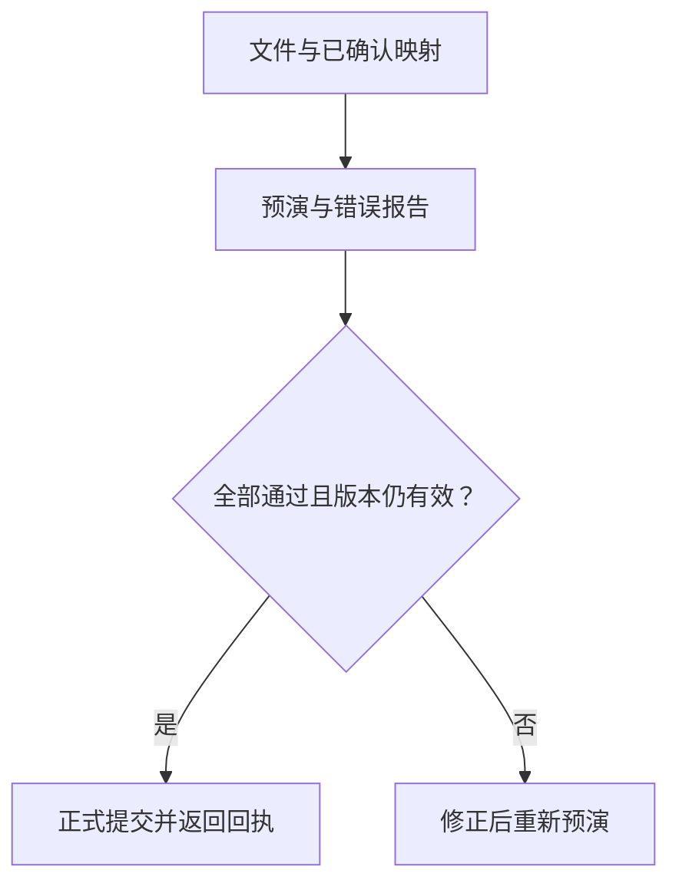

# AI辅助客户数据导入：字段映射、预演校验与正式提交

客户上传一张表，列名是“地点、人群类型、日期、人数”，业务系统需要稳定对象ID、枚举、标准日期和非负整数。AI能帮助理解字段，但导入真正难在：映射是否正确、错误是否可定位、数据是否重复、预演后权限或目标数据有没有改变。

本篇提供独立CSV教学导入器，适合客户初始化、门店指标导入、区域数据补录和运营表格接入。参考Frictionless开源项目的数据描述与校验思路；导入策略、权限与提交逻辑独立编写。全部对象、租户和数据虚构，不是生产客户数据。

## 1. 先确定数据用途与目标模式

导入前先问清这张表要新增什么业务对象、写到哪里、是否允许覆盖，以及谁有权操作。“让AI读取文件”并没有回答这些业务问题。

示例每行是一条对象人群统计记录，业务键为`(object_id, population_type, snapshot_date)`。只能新增，已有键拒绝覆盖。它不创建新地点，也不导入个人轨迹、围栏或画像明细。

| 目标字段 | 教学约束 | 为什么需要 |
|---|---|---|
| object_id | 在授权对象集合中 | 将数据绑定到正确对象 |
| population_type | 1、2、3、4 | 避免混用人群含义 |
| snapshot_date | YYYY-MM-DD有效日期 | 防止错误日期进入统计 |
| population_count | 0到999999999的整数 | 不把空值、负数或小数当有效人数 |

1到4分别假定为居住、工作、常驻和客流。真实产品应从版本化枚举取得含义，不能让模型自行解释。人数为0是有效输入；人数为空是缺失，不能自动补0。

## 2. 字段映射建议和已确认映射分开

AI可以建议“人数→population_count”，但“日期”可能是采集日期、统计日期或上传日期，“地点”可能是名称而不是ID。建议必须经过业务确认，不能把语义相似直接当作正确映射。

示例要求显式一对一映射：

```json
{
  "地点": "object_id",
  "人群类型": "population_type",
  "日期": "snapshot_date",
  "人数": "population_count"
}
```

缺字段、重复目标字段、额外字段或映射与表头不匹配都拒绝。程序没有调用模型，不会自动推断列含义。若文件只有地点名称，应先用[对象解析](16-business-object-resolution.md)确认稳定ID，再导入；这两份教学脚本尚未集成。

## 3. 解析文件时保留可定位信息

示例接收已经解码的Unicode CSV文本，用标准库CSV解析器，处理UTF-8 BOM与字段前后空白。表头规范化后必须恰好有四个不同且非空的名称；每条记录必须恰好四个单元格。

不能简单按逗号切分CSV，带引号的内容可能包含逗号或换行。程序中的`record_number`表示解析记录序号，表头为1；含多行引号单元格时，它不等于物理文本行号。产品界面应说明所用定位方式。

实际文件服务还需要文件大小、编码、格式和解析失败处理。本文上限是UTF-8编码后64KiB、1000条记录；不支持XLSX、合并单元格、多个工作表或大文件流式处理。乱码文件应先确定编码，不能默默忽略坏字节。

## 4. 类型转换应可解释且可复算

程序将合法人群类型和人数转成整数，检查日期实际存在，并要求标准日期格式。例如2026-02-30无效；20260930即使能被某些日期解析器接受，也不是本协议允许的形式。

人数允许0，不接受1.2、−3、空白或超出九位的数字。人群类型只允许单字符1到4，避免把“4.0”或未知值自动猜成客流。

自动修复应区分可确定修复和业务猜测。去掉值前后空格通常可确定；把空人数补0、把错误日期改成月底、把陌生人群类型映射成4，都会改变业务事实，应另行确认并保存修复记录。本文只做有限格式规范化，不猜测业务值。

## 5. 错误报告告诉用户如何修正

示例错误记录只包含记录序号和代码，例如：

```json
{"record_number": 2, "code": "population_count"}
```

生产界面可将代码翻译为“第2条记录的人数应为非负整数”，并展示已授权的字段定位。错误记录不必回显整行客户数据，特别是其中包含敏感信息时。

对象不在授权集合时统一返回`object_not_allowed`，不区分“确实不存在”和“存在但无权查看”。程序不返回候选对象名称，避免通过错误提示探测未授权资产。

每条记录只报告第一个发现的问题。用户修正后重新预演可能看到后续问题；生产可以收集多个字段错误，但要控制数量与信息暴露。本文不提供自动纠正文件或人工批量编辑界面。

## 6. 重复记录与已有数据各有规则

同一文件内出现相同业务键，无论人数是否相同，示例都标为`duplicate_key`。它不会自动取最后一行、求和或删除重复记录，因为这些处理对应不同业务含义。

目标数据集中已有相同键也拒绝。要修订已有记录，需要另外定义覆盖权限、数据版本、修改理由与审计，并给客户展示改前改后的值。

本例业务键只适用于教学统计记录。若真实模型允许同地点多个围栏或多个数据来源，必须把相应维度加入唯一键；不能把有意义的多条记录误判成重复。

## 7. 预演必须明确没有发生写入

`preview`解析、校验并保存服务端计划，返回文件SHA-256、字段映射对应的计划ID、目标数据版本、权限版本、错误清单与有效期。预演不会修改目标数据集。

`accepted_rows=2`表示有两条记录通过行校验，不表示已经写入两条，也不表示这两条会在错误批次中单独提交。若任一记录错误，状态为`invalid`，正式提交整批拒绝。

这一“全部通过才提交”政策适合初期试点。允许部分导入也可以，但必须明确成功记录、失败记录、再次导入去重和跨行约束。不要悄悄跳过坏行后给客户显示“导入成功”。本文没有部分提交模式。

## 8. 正式提交重新检查范围与版本

预演到提交之间可能有人撤销权限，也可能另一份文件已写入。计划保存租户、操作者、权限版本和目标数据版本，`commit`逐项重检。版本变化时要求重新预演，避免用旧计划覆盖新事实。

计划在300个整数时间单位后到期，起始时间包含、结束时间不包含。时间和授权上下文在生产中应由服务端提供；本文显式参数仅为离线夹具。



计划ID在服务端随机生成，客户不能在正式提交时替换其中的行数据。文件摘要用于追溯文本，不是签名或授权证明。同内容不同换行会得到不同文件摘要；语义去重需要另外的规范化摘要和业务政策。

## 9. 提交幂等与原子性分别保证

提交成功后，客户端可能未收到结果。相同计划ID在有效期内重试，返回原回执并标`replayed=true`，不会再写一次或再次增加数据版本。

示例在一个进程锁内复制目标数据、检查业务键、一次替换数据集并保存回执。任何校验失败都不发布复制的数据。两个线程同时提交同计划，一次写入、一次回放。

这是单进程内存教学实现，不是数据库事务。进程退出后计划、记录和回执全部丢失，没有崩溃恢复或跨进程幂等保证。生产应把正式数据、导入状态、回执及唯一约束放入合适的事务边界，并使用持久作业记录处理大批量导入。

示例到期后连回放也会拒绝，因此真实系统还需要独立的授权回执查询接口，让客户确认旧请求是否已完成。不要因为无法继续重试，就推断此前没有写入。

## 10. 开源实现能提供哪些基础

[Frictionless固定提交README](https://github.com/frictionlessdata/frictionless-py/blob/6c7146c07fa0f15b5c1bdc09e73309fb339dfe9a/README.md)介绍表格数据描述、读取、校验与转换，并演示带记录、字段、错误代码和信息的统一校验报告。可以参考它组织schema与错误诊断，逐步替换自建解析层。

本文的租户、授权对象、预演计划、业务键与提交政策为独立设计，不是Frictionless自动提供的客户导入工作流。没有安装或运行该框架，也没有复制上游程序代码。[固定来源记录](examples/customer-data-import-sources.json)与[MIT许可副本](examples/frictionless-LICENSE.md)保留具体学习范围。

真实项目使用框架时仍需要业务规则检查，例如对象是否属于当前客户、日期是否在可导入范围、人数口径是否一致。通用schema通过不意味着这些业务条件已经满足。

## 11. 运行与实际检查结果

```bash
python knowledge/business-ai-cases/examples/customer_data_import.py
python knowledge/business-ai-cases/examples/test_customer_data_import.py
```

[源码](examples/customer_data_import.py)只依赖Python标准库。2026-10-05在Python3.12.14运行[20项检查](examples/test_customer_data_import.py)，全部通过：预演不写入、正式计数、重复提交、含错误整批拒绝、枚举、日期、人数、重复键、授权对象、表头、单元格数、字段映射、BOM、到期、权限和数据版本变化、租户/操作者绑定、大小与空文件以及双线程重复提交。

[运行记录](examples/customer-data-import-results.json)包括有效预演、两条写入、同计划重试和错误预演。真实运行的计划ID随机生成；文档结果中的ID替换为稳定教学名称，方便阅读，不能用于真实提交。

当前没有模型字段推断、真实认证、持久存储或Frictionless执行。`grant`是教学配置方法，不是真实权限申请接口；生产调用者不能自行声明租户、操作者或授权对象。程序也不包含完整API恶意输入防护和生产负载验证。

## 12. 怎样评估业务效果

先收集已授权的典型文件，人工标注正确映射、应拒绝记录、唯一键与目标数据。分别衡量字段映射正确率、错误定位可修复性、错误数据漏入率、重复写入和版本冲突后的恢复体验，不只统计“文件读出来了”。

先作为客户初始化的内部辅助工具，比较人工清洗工时、往返沟通次数和导入返工。不要为了提高成功率自动修正未知对象或覆盖旧数据。

练习：将样例人数改为空，确认预演标错且没有写入；让另一份有效计划先提交，确认旧计划需要重新预演。接入真实数据库前再补持久回执、事务测试、权限来源和撤销验证，最后扩展到大文件分批导入。

[返回业务案例目录](README.md) · [返回总入口](../../README.md)
