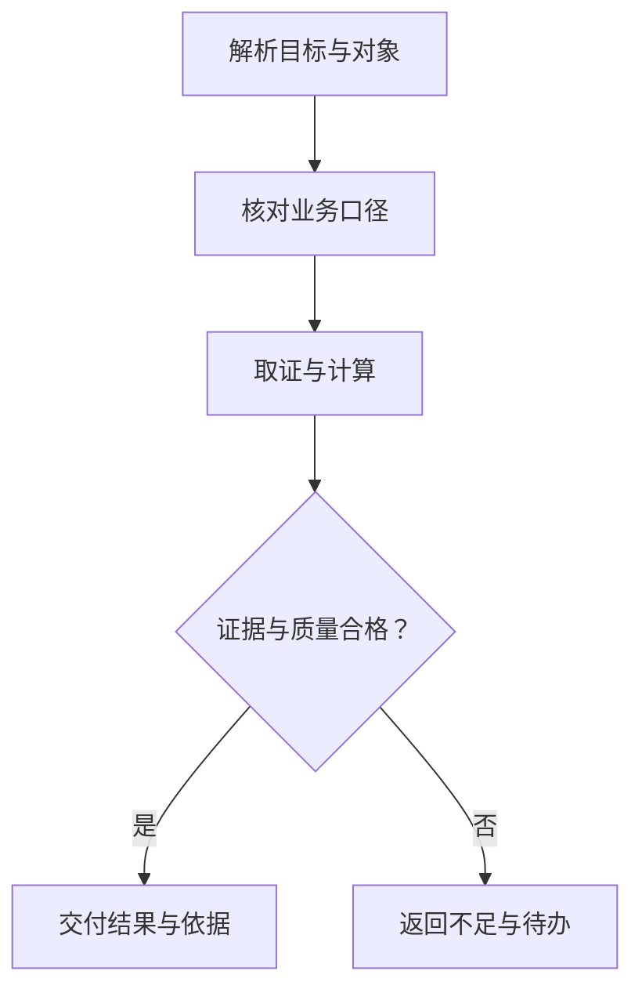

# AI 业务应用案例：从问题到可验收结果

这组内容把[100项应用知识](../ai-application-playbook/README.md)展开成十个完整业务案例，并增加HTTP集成、工具注册路由、批量查询、金标准评测、结果缓存、对象解析与结果校验七篇教程，覆盖取数、经营分析、售前、客服、报表、后台作业和商务文档。每篇说明业务价值、指标或规则、工具编排、可复算样例、结果表达和验收边界。

全部数据与ID虚构；所有业务规则为独立教学定义，不代表任何公司现有接口、经营数据或已上线效果。开源项目提供工具、检索、状态与评测机制依据，不直接提供本篇的业务功能。案例中的接口名称为设计建议。

| 案例 | 面向的业务决定 | 主要业务风险 | 已运行函数 |
|---|---|---|---|
| [区域洞察：近90天某业态触达占比](01-area-category-coverage.md) | 比较区域人群观察到的业态到访 | 分子分母范围混用 | coverage |
| [竞品分析：共访人数、方向比例与排行](02-competitor-co-visitation.md) | 识别共享客群与竞品候选 | 方向比例与迁移误读 | co_visit |
| [客群运营：新老客定义与老客频次](03-new-returning-customers.md) | 区分拉新和复访观察 | 历史覆盖不足却称终身新客 | cohort |
| [客流趋势：同日型对比与异常解释](04-traffic-trend-and-diagnostics.md) | 确认变化并核查质量 | 不成熟数据和无证据因果 | matched_day_trend |
| [选址推荐：硬约束、可解释评分与缺失数据](05-site-selection-decision-card.md) | 筛选现场调研候选 | 缺字段打分与收益率误读 | site_score |
| [销售支持：客户需求与产品能力匹配](06-sales-capability-matching.md) | 回应客户需求与能力缺口 | 承诺尚未支持的功能 | capability_match |
| [客户服务：问题分类、工单路由与响应优先级](07-customer-support-ticket-routing.md) | 分流问题并记录处理状态 | 状态误报与重复工单 | ticket_route |
| [经营报告：结论、证据、缺失项与审核](08-business-report-evidence.md) | 形成带证据的经营草稿 | 引用存在却不支持结论 | build_report |
| [画像预热：批量对象、部分失败与可恢复作业](09-profile-prewarm-job.md) | 提前读取常用画像 | 去重键不全与无限重试 | prewarm |
| [商务文档：报价字段提取与金额复核](10-quote-document-validation.md) | 复核报价明细合计 | 币种与精度混用 | quote_total |
| [API Agent：身份、契约、工具与HTTP结果](11-api-agent-http-integration.md) | 将区域占比与共访接成可验证接口 | 越权、口径错配与状态误读 | DemoService.execute |
| [业务工具注册与任务路由](12-business-tool-registry-routing.md) | 将多接口组织为受控能力 | 歧义选择、旧计划与权限失效 | Registry.plan / execute |
| [批量业务查询：去重、并发与部分失败](13-batch-business-query.md) | 比较或预热多个业务对象 | 错配结果、跨口径合并与并发压力 | run_batch |
| [业务Agent金标准评测](14-business-agent-golden-evaluation.md) | 定位回归与验收交付 | 平均分掩盖越权、漏评与标签泄漏 | evaluate / grade |
| [业务结果缓存与失效](15-business-result-cache.md) | 减少可信重复计算 | 旧权限、旧口径与多源数据失效遗漏 | CachedBusiness.query |
| [业务对象解析与澄清](16-business-object-resolution.md) | 将地点名称落实为授权稳定ID | 同名错选、越权候选与旧澄清结果 | Resolver.resolve / choose |
| [业务结果校验与证据协议](17-business-result-contract.md) | 校验结果后再交付事实 | 错范围、自洽错数与失效证据 | validate_result |

## 一条可落地的业务流程

1. 解析业务目标及对象，保存用户原始要求。
2. 从版本化定义取得口径、约束和必须交付项；不让模型临时决定业务公式。
3. 受控工具取得证据，身份和权限由服务端绑定。
4. 确定性函数计算，质量检查决定ok、partial、provisional、missing等状态。
5. 模型解释结果与不足，交付产物保留运行、数据和规则版本。



上图是本文工程设计，不是某个框架现成自动保证的行为。各场景仍需按实际数据权限、产品协议和执行环境实现。

## 最小结果协议

正式接口建议共用request_id、status、object_ref、time_range、definition_version、data_version、quality、result、evidence和missing_fields。不是每篇教学函数都已实现这些字段；示例只实现可独立验证的核心计算。只读分析与工单创建、外发、正式报价等执行操作分开验收。

模型不做身份裁决、金额心算或原始用户集合聚合。正式服务应在受控后端返回汇总与必要证据，避免将个人原始轨迹暴露给模型。源数据完整性、估计偏差和成熟度也不因公式正确而自动解决。

## 可运行的示例与检查

```bash
python knowledge/business-ai-cases/examples/business_rules.py
python knowledge/business-ai-cases/examples/test_business_rules.py
```

Python3.12.14，标准库即可。2026-10-04实际运行十个函数场景，14项检查全部通过；[示例输出](examples/expected-results.json)保存本次结果。覆盖50%区域占比、方向共访50%/100%、事件去重、同日型−10%、选址66分、能力缺口、工单队列、部分证据、3项预热/4次读取和2700.00元合计。

仅验证教学计算与失败边界；没有调用模型、数据库生产服务、真实站点、CRM、工单、缓存或报价系统，也未实测这些项目的完整集成。真实项目还需协议、权限、并发、网络失败与人工金标准评测。不得把14项检查当成业务端到端正确率。

### HTTP集成示例

[API Agent教程](11-api-agent-http-integration.md)将区域占比和共访接成标准库HTTP服务，附身份夹具、输入契约、租户隔离、数据版本与成熟度检查。2026-10-04在Python3.12.14运行23项真实回环HTTP检查，全部通过；[五组结果](examples/api-agent-http-results.json)保存成功、空分母、未成熟与越权返回。

```bash
python knowledge/business-ai-cases/examples/test_api_agent_demo.py
```

这是独立编写的教学编排器，参考FastAPI固定提交文档；尚未调用模型、真实OAuth或生产数据库，不能据此宣称业务已经上线。

### 工具注册与任务路由

[注册表教程](12-business-tool-registry-routing.md)将业务目标、能力权限、对象权限与可用状态分层，附版本绑定、歧义拒绝、参数白名单和执行时重检。2026-10-04运行17项离线检查全部通过，复用HTTP教程的合成数据计算；未调用模型或真实接口。

```bash
python knowledge/business-ai-cases/examples/test_tool_registry_demo.py
```

[运行结果](examples/tool-registry-results.json) · [固定来源记录](examples/tool-registry-sources.json)

### 批量业务查询

[批量查询教程](13-batch-business-query.md)补齐输入关联ID、整批与单项错误、有效参数去重、并发上限、结果复制和业务状态。2026-10-05运行13项离线检查全部通过，包含真实线程下乱序完成与并发峰值检查；未调用模型、HTTP或生产数据源。

```bash
python knowledge/business-ai-cases/examples/test_batch_query_demo.py
```

[六项查询结果](examples/batch-query-results.json) · [固定来源记录](examples/batch-query-sources.json)

### 业务金标准与评分器

[金标准教程](14-business-agent-golden-evaluation.md)附12道结构化题、路径断言、分层统计与固定数据集指纹。2026-10-05全部题通过，10项评分器故障注入检查通过；证据维度仅1道题，不代表完整模型或生产评测。

```bash
python knowledge/business-ai-cases/examples/business_golden_eval.py
python knowledge/business-ai-cases/examples/test_business_golden_eval.py
```

[题集](examples/business-golden-dataset.json) · [评测报告](examples/business-golden-report.json) · [固定来源](examples/business-golden-sources.json)

### 业务结果缓存

[缓存教程](15-business-result-cache.md)讲解参数规范化、租户与权限边界、区域/竞品版本、TTL、LRU与旧结果降级。2026-10-05运行14项顺序夹具检查全部通过；未运行Redis、真实接口或并发服务。

```bash
python knowledge/business-ai-cases/examples/test_business_cache_demo.py
```

[结果记录](examples/business-cache-results.json) · [固定来源](examples/business-cache-sources.json)

### 业务对象解析与澄清

[对象解析教程](16-business-object-resolution.md)附标签/别名精确查找、城市与类型约束、授权候选、截断需细化及版本绑定的内部选择流程。2026-10-05运行14项离线检查全部通过；未运行LLM、向量检索、Qdrant或真实对象库。

```bash
python knowledge/business-ai-cases/examples/test_business_object_resolver.py
```

[解析结果](examples/business-object-results.json) · [固定来源](examples/business-object-sources.json)

### 结果校验与证据协议

[结果校验教程](17-business-result-contract.md)附可信教学依据、范围与数学核对、证据绑定、业务状态和事实视图白名单。2026-10-05运行18项离线检查全部通过，包含五份合法返回与错误输出注入；未验证真实来源服务或模型解释。

```bash
python knowledge/business-ai-cases/examples/test_business_result_contract.py
```

[五份校验结果](examples/business-result-contract-results.json) · [固定来源](examples/business-result-contract-sources.json)

## 如何做业务试点

先选一个高频只读场景，提供已授权样本与人工答案，固定口径后做影子评测。比较原人工流程与新流程的取数/复核时间、口径错误、证据覆盖和实际成本，再逐步引入执行动作。验收阈值由业务方确定，本篇不虚构收益比例。

优先从区域占比、共访或报价合计等可复算任务开始。生成无证据原因、推荐收益、自动发送或创建真实对象，都不属于这些离线示例已经验证的能力。

[开源机制与许可](../agent-case-studies/sources.md) · [机器可读案例清单](catalog.json) · [返回总入口](../../README.md)
