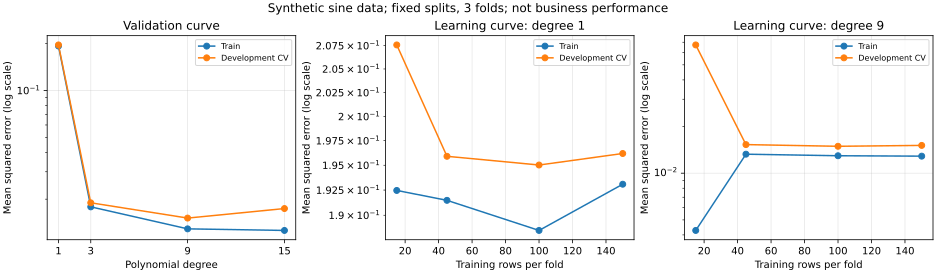

# 18｜学习曲线与验证曲线：该加数据、改模型，还是检查流程？

> 目标：区分数据量、超参数与训练迭代三个横轴；用训练/验证差异提出诊断假设，而不是机械套口诀。

## 1. 三种曲线不要混淆

| 曲线 | 横轴 | 固定或控制的内容 | 主要问题 |
| --- | --- | --- | --- |
| 学习曲线 | 拟合样本数量 | 模型配置、评估协议 | 更多同类数据是否可能有帮助？ |
| 验证曲线 | 一个超参数，如 degree、C | 其他配置、开发数据切分 | 该参数怎样影响拟合与泛化？ |
| 训练日志曲线 | epoch、step 或运行时间 | 本次训练过程 | 优化是否收敛、何时早停？ |

本篇运行前两种。增加训练样本不等于多跑 epoch；把每轮训练 loss 画出来，也不等于完成了样本量学习曲线。

## 2. 两条线分别在哪些数据上算？

训练分数在模型实际拟合的样本上计算；验证分数在对应模型未用来拟合的验证样本上计算。

学习曲线对每个训练大小、每折重新拟合一份模型；验证曲线对每个参数值、每折重新拟合。不能把同一个全数据模型拿不同数量记录评估，就叫“训练规模学习曲线”。

最终测试应另留。曲线用于诊断或选参数时，开发验证数据已经参与决策，其最好分数不再是独立最终性能。

## 3. 一定要先统一分数方向

Accuracy、AP、R² 通常越高越好；MSE 越低越好。scikit-learn 的 neg_mean_squared_error 按负 MSE 作为 scorer，因此绘图前用负号转回正 MSE。

训练 MSE 很低而验证 MSE 高，才是“训练好、验证差”。如果误把负 MSE 越负解释为越好，会把结论颠倒。

图中的纵轴使用对数刻度。它用于看误差数量级，不表示模型损失变成了对数损失。三个面板各自自动设置纵轴范围，不能仅按线条在画面里的高度跨面板比较。

## 4. 常见形状是线索，不是诊断证明

| 观察 | 可能的解释 | 下一步检查 |
| --- | --- | --- |
| 训练与验证都差 | 表示不足、模型限制、训练未收敛、标签问题 | 基线、特征、优化日志与标签质量 |
| 训练好、验证差 | 过拟合、切分不匹配、群体或时间变化 | 数据边界、正则化、模型复杂度 |
| 更多数据后验证改善、差距缩小 | 数据量可能限制泛化 | 数据质量和分布是否相同 |
| 更多数据后两条线都停滞 | 当前表示/模型或数据噪声可能限制 | 新表示、标签质量、合理模型基线 |

这些不是严格的偏差/方差分解。单条学习曲线无法单独识别所有误差来源，有限数据与随机波动也会改变形状。

训练分数低于验证分数并非绝对不可能，例如训练子集更难、损失定义不同、随机扰动或数据权重不同。应先核对评估方式，而不是直接判为代码错误。

## 5. “加数据”也有条件

更多同分布、质量足够的数据可能帮助高方差问题。但大量重复门店记录并不等于新增同等数量的独立证据。

新增城市、不同传感器、不同月份可能改变分布。不能从历史随机切分学习曲线，直接保证采集新城市数据会产生同样收益。

本例只改变训练样本数量，不改变特征数和表示。若低容量模型无法表达目标关系，复制更多同类样本不会自动变成非线性模型。

## 6. 本次合成实验

使用 300 条一维人工数据：
y=sin(πx)+噪声，x 在 [−1,1] 中采样，噪声标准差为 0.12。

先固定划出 75 条最终测试；225 条开发数据使用固定随机种子的三折 KFold，每折训练池为 150 条。Pipeline 为：

PolynomialFeatures → StandardScaler → Ridge(alpha=1e−6)。

缩放在每次拟合的训练子集学习，避免使用验证分布。多项式次数越高，表示越丰富，但高阶幂可能带来共线性和数值敏感，因此使用 Ridge；这不是推荐所有业务采用同样的 alpha。



左图改变次数；中图固定一次；右图固定九次。这里“九阶”指多项式次数，不是九层神经网络或训练九轮。

## 7. 验证曲线的已运行结果

| 次数 | 平均训练 MSE | 平均开发验证 MSE |
| --- | --- | --- |
| 1 | 0.193086 | 0.196192 |
| 3 | 0.017845 | 0.018950 |
| 9 | 0.012885 | 0.015115 |
| 15 | 0.012586 | 0.017408 |

一次模型在该构造关系上表达不足；三次和九次明显改善。十五次训练误差略低，但开发验证误差高于九次，说明追求最低训练误差未必得到最好验证结果。

此实验仅改变 degree；不能因此认定九次在所有 alpha、样本规模或噪声下最优。参数之间存在交互，一维验证曲线适合探索，完整选择可用联合搜索。

## 8. 样本量学习曲线的已运行结果

| 每折训练行数 | 一次训练 MSE | 一次验证 MSE | 九次训练 MSE | 九次验证 MSE |
| --- | --- | --- | --- | --- |
| 15 | 0.192461 | 0.207573 | 0.004275 | 0.067222 |
| 45 | 0.191476 | 0.195906 | 0.013266 | 0.015300 |
| 100 | 0.188505 | 0.195021 | 0.012964 | 0.014918 |
| 150 | 0.193086 | 0.196192 | 0.012885 | 0.015115 |

九次模型少样本时训练误差极低、验证误差较高；从 15 增到 45 行后差距明显缩小。之后改善不严格单调，不能承诺每次加数据都一定降低误差。

训练误差随更多数据上升也不矛盾：拟合更多、覆盖更广的记录通常更难，原来容易记住的小样本不代表全部数据。

一次模型误差停在较高水平，符合当前表示较受限制的解释；但真实任务遇到类似图形，仍应排除标签、优化和评估问题。

## 9. 可运行核心 API

完整代码：[learning_validation_curve_checks.py](examples/learning_validation_curve_checks.py)。

验证曲线：

```python
train, valid = validation_curve(
    estimator(1), X_dev, y_dev,
    param_name="poly__degree", param_range=[1, 3, 9, 15],
    scoring="neg_mean_squared_error",
    cv=cv, error_score="raise"
)
```

学习曲线：

```python
sizes, train, valid = learning_curve(
    estimator(9), X_dev, y_dev,
    train_sizes=[15, 45, 100, 150], cv=cv,
    shuffle=True, random_state=42,
    scoring="neg_mean_squared_error", error_score="raise"
)
```

片段使用完整脚本定义的 estimator、开发数据与 cv，不是独立程序。完整脚本检查数组形状、实际样本数和有限值，打印各折汇总，再按开发验证 MSE 选择次数。

```bash
python knowledge/classical-ml/examples/learning_validation_curve_checks.py
# 可选：安装 matplotlib 后输出 SVG。
python knowledge/classical-ml/examples/learning_validation_curve_checks.py --output /tmp/learning-validation-curves.svg
```

按开发验证选中九次模型后，在全部开发集重新拟合；最终测试 MSE≈0.018329，只用于报告。本篇没有在最终测试上选择参数。

## 10. train_sizes 与 shuffle 的细节

整数 train_sizes 是每折训练子集的行数，不是整批数据量；浮点比例通常相对于可用训练池规模。实际返回的 sizes 应核对，不能只看传入比例。

learning_curve 的 shuffle 控制训练池中取子集的顺序，和 KFold 的 shuffle 不是同一开关。本例显式设置两者和随机种子，仅针对独立采样合成数据。

分类任务即使用分层折，较小训练前缀仍可能缺少某类；应检查最小子集标签覆盖，必要时采用明确的自定义子集协议。error_score="raise" 帮助尽早发现失败，而非让 NaN 混进平均。

对于时间序列或门店分组，随意打乱、取训练池前缀可能破坏任务语义。应设计按时期、完整实体组或业务可用数据增长的实验，不能直接复制本例的随机切分。

## 11. 折间标准差与计算成本

本例输出每个参数的折间标准差，图只绘制均值，未画置信区间。三折不是三次独立业务部署；训练数据重叠，标准差也不是完整总体不确定性。

验证曲线 4 个次数×3 折=12 次拟合；两组学习曲线各 4 个规模×3 折，总计 24 次；最终重训 1 次，共 37 次拟合。

超参数、特征选择和预处理要在对应训练边界内学习。学习曲线默认重新训练每个规模，本例未使用增量训练；不要假设相邻点只训练新增数据，或 warm_start 自动等价。

若额外比较算法、改候选范围或观察多张曲线，选择成本还会增加。可以保留实验记录，避免只展示最终最好的一张图。

## 12. 练习与答案

1. 横轴 epoch 的 loss 图是本篇学习曲线吗？答：不是，这里横轴是训练样本数。
2. 两条误差都高一定是模型太简单吗？答：不，也要检查优化、表示和标签。
3. 更多重复行等于更多独立证据吗？答：不，可能只是重复记忆。
4. 看开发曲线选参数后，能用同一最高 CV 分数当最终性能吗？答：不，应另用最终测试或外层验证。
5. 三折标准差是完整置信区间吗？答：不是。
6. 合成数据九次最好，真实门店也一定九次最好吗？答：不，表示和参数应依据真实任务验证。

## 来源与验证

核验日期：2026-10-04。[scikit-learn 官方开源文档 learning_curve.rst](https://github.com/scikit-learn/scikit-learn/blob/a442e4bb39551feb7b0af4c00075e2cb91cf9b77/doc/modules/learning_curve.rst)，固定提交 `a442e4bb39551feb7b0af4c00075e2cb91cf9b77`，[BSD 3-Clause](https://github.com/scikit-learn/scikit-learn/blob/a442e4bb39551feb7b0af4c00075e2cb91cf9b77/COPYING)。

中文解释、人工数据、代码和图表独立编写，非官方逐字翻译。实跑 scikit-learn 1.8.0、NumPy 2.3.5，SVG 使用 matplotlib 生成并检查；来源主分支与安装版本不完全相同。未开展真实业务评估、分类覆盖实验或严格偏差/方差分解。

[返回专题目录](README.md)
