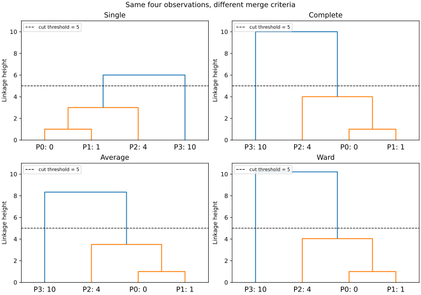

# 05 层次聚类：合并规则、树状图与切分边界

> 目标：能手算四种 linkage，读懂树状图，并知道聚类树能回答什么问题。
>
> 前置：[K-means](01-kmeans-and-cluster-evaluation.md)、[GMM](04-gaussian-mixture-and-em.md)。本篇讨论样本聚类，不是把特征列合并的 FeatureAgglomeration。

## 1. 一次分组为什么不够

假设要整理一组商品：既希望看到“食品与日用品”这样的大分组，也希望往下查看饮料、零食等细分结构。层次聚类给出一串嵌套分组，而不只给一组固定标签。

层次方法有两类方向：

- 凝聚式（agglomerative）：每个样本先是一个簇，逐次合并两个簇。
- 分裂式（divisive）：从大簇开始逐次拆分。BisectingKMeans 是相关例子，本篇不展开其实现。

scikit-learn 的 AgglomerativeClustering 使用凝聚式方法。若构建完整树，n 个样本经过 n−1 次二元合并，最后成为一个总簇。

“商品类别”只是帮助理解的类比。算法看到的是特征与距离，并不知道业务分类名称；树上某个节点不自动代表真实业务类别。

## 2. 两个簇之间有多远：四种规则

设簇 A、B，样本距离为 d(x,y)。算法在当前可合并的簇对中，选择合并代价最小者。

| linkage | 合并依据 | 常见倾向及限制 |
| --- | --- | --- |
| single | 两簇跨簇点对的最小距离 | 容易沿近邻链连接，能追随非球形结构，也容易被桥接点串联 |
| complete | 两簇跨簇点对的最大距离 | 倾向限制簇跨度，对远端点敏感 |
| average | 所有跨簇点对距离的平均值 | 兼顾多个点，不等于两个簇中心距离 |
| ward | 合并造成的簇内平方误差增量 | 倾向较紧凑分组，要求欧氏距离；不保证等大小或全局最优 |

前三者可写为：

$$
D_{single}(A,B)=\min_{x\in A,y\in B}d(x,y)
$$

$$
D_{complete}(A,B)=\max_{x\in A,y\in B}d(x,y)
$$

$$
D_{average}(A,B)=\frac{1}{|A||B|}
\sum_{x\in A}\sum_{y\in B}d(x,y)
$$

这里 average 对所有点对平均，不是“两个簇各占一半，再平均中心”。每次合并都根据当前簇重新考虑代价；普通凝聚过程不会回头拆开一个已经合并的簇。

这是一种逐步局部选择。它不能保证最终固定 K 个簇时，得到所有可能分组中最好的目标值。

## 3. Ward 到底增加了什么

一个簇的 SSE（簇内平方误差）是样本到其均值的平方距离总和。设两簇样本数为 n_A、n_B，均值为 μ_A、μ_B，则合并增加量：

$$
\Delta SSE=
\frac{n_A n_B}{n_A+n_B}
\|\mu_A-\mu_B\|^2
$$

簇越大、中心越远，合并可能造成的增量越大。Ward 选择增量最小的簇对。

特别注意：在本文核验的 scikit-learn/SciPy Ward 约定中，树状图记录的高度是：

$$
h=\sqrt{2\Delta SSE}
$$

它既不是 ΔSSE 本身，也不是一般情况下的中心距离。两个单样本合并时高度恰好是欧氏距离，容易让人误以为所有后续高度也都如此。

Ward 与 K-means 都关联 SSE，但一个逐次合并，一个迭代重新分配样本；它们不保证得到相同分组。Ward 不能直接搭配 cosine、Manhattan 或 precomputed 指标。

## 4. 四个点手算完整树

一维坐标分别为 P0=0、P1=1、P2=4、P3=10。

第一步四种规则都合并 {0} 和 {1}。single、complete、average 高度为 1；Ward 的 ΔSSE=0.5，所以高度也为 1。

第二步考虑 {0,1} 和 {4}：

- single：min(4,3)=3。
- complete：max(4,3)=4。
- average：(4+3)/2=3.5。
- Ward：中心 0.5 与 4，ΔSSE=(2×1/3)×3.5²=49/6，高度 √(49/3)≈4.041452。

这些候选在各自规则下都是当轮最小者，所以都合并成 {0,1,4}。

第三步把 {0,1,4} 与 {10} 合并：

| 规则 | 最终高度 | 算法含义 |
| --- | ---: | --- |
| single | 6 | min(10,9,6) |
| complete | 10 | max(10,9,6) |
| average | 8.333333 | (10+9+6)/3 |
| Ward | 10.206207 | ΔSSE=625/12，高度 √(625/6) |

四种规则在此例中拥有同样的合并成员，但高度不同。**这不代表一般数据的树结构也相同**。

图中横轴标签是样本编号与坐标；纵轴是各自规则的合并高度。所有面板统一纵轴范围方便查看，但不同规则的高度含义不同。虚线为阈值 5，本例都得到 {0,1,4} 和 {10}。

## 5. 如何读树状图

叶子代表样本，分叉处代表一次合并，分叉的高度表示当轮 linkage 代价。

树状图横轴最容易误读：

- 叶子通常按展示树的需要排序，不是按数值大小或时间排序。
- 图中两个标签横向靠近，不等于两个样本距离小；要看它们首次共同祖先的高度。
- 子树左右交换不会改变层次分组。
- 树的颜色由绘图切分设置决定，不是算法发现的业务等级。

若在高度 t 切树，可以得到一个粗细程度对应的分组。较高切线通常产生较少簇。但不要看到“大跳跃”就宣布存在真实类别：要结合尺度、异常点、采样稳定性和业务检验。

全量大树可能拥挤到没有解释价值。截断或只画部分叶子时，应说明哪些节点代表多个原始样本，避免把简化图误认为全部细节。

## 6. 切 K 个簇，还是切高度

两个常用选择方式：

~~~python
from sklearn.cluster import AgglomerativeClustering

# X 是 (样本数, 特征数) 数组
fixed_k = AgglomerativeClustering(
    n_clusters=2, linkage="average", metric="euclidean"
).fit(X)

by_height = AgglomerativeClustering(
    n_clusters=None,
    distance_threshold=5,
    compute_full_tree=True,
    linkage="average",
).fit(X)
~~~

distance_threshold 非 None 时，n_clusters 必须为 None，compute_full_tree 必须为 True。compute_full_tree="auto" 在相应情况下可自动使用完整树；上例明确写 True 便于学习。

**库的阈值语义是：合并高度大于或等于阈值时，不进行该合并。** 四点例子的最小高度是 1：

| 阈值 | scikit-learn single 簇数 |
| --- | ---: |
| 1.0 | 4 |
| 1.0000000000000002 | 3 |

第二行是 np.nextafter(1.0, np.inf)，即浮点数 1 之后的可表示数。不是建议生产阈值靠最后一位小数调参，而是证明相等边界有实际意义。

其他工具的切树函数可能用不同相等约定。跨库比较时要检查实际规则。出现多个相同高度时，指定 K 还可能截取其中部分合并；距离阈值不一定能表达每一个 K 的结果。

## 7. single 的“链式效应”

考虑 [0,1,2,3,4]。相邻点距离全为 1。使用 single 和阈值 1.1，所有点能通过相邻连接串成一个簇，尽管首尾距离为 4。

同一数据、同一阈值下，complete 本次得到 3 个簇；具体标签/同距离的合并顺序可能因实现和输入顺序而变，不能把这种并列选择说成唯一数学答案。

single 的低合并高度约束“至少有近连接”，不是约束簇中任意两点都近。它不是一定差：细长形状可能需要沿近邻连接；如果桥接点来自噪声，结果就可能偏离业务需要。

用 complete 或 Ward 也不能自动解决所有问题。complete 会受极端点影响，Ward 可能切开真实的细长结构。应围绕数据几何和任务选择，而不是固定宣称某种 linkage 最优。

## 8. 距离、预计算矩阵和连通约束

### 距离是建模选择

连续特征单位差别很大时，需要考虑缩放。金额、次数和距离放在一起，原始单位可能让某列主导结果。

对非零向量，cosine 关注方向；不能直接拿全零向量计算有意义的方向距离。需要先明确空文本、零向量的处理。指标的选择应有业务依据，而不是挑一张“好看”的图。

### precomputed 输入的是距离

single、average、complete 可以使用 metric="precomputed"，输入 n×n 的距离矩阵。

该矩阵应与样本顺序严格一致、对称、非负、对角为零，并应符合选用方法所需的距离含义。不要直接传相似度：相似度越大通常越近，距离越大越远，两者方向相反。

即使库没有替你检查所有语义，也必须自行检查。相似度转距离需要针对其定义制定规则，不能一律使用“1−相似度”。

### connectivity 改变候选合并

connectivity 描述允许考虑的邻接结构，例如相邻像素、已有图关系或近邻图。它能减少候选搜索，并把局部结构引入分组。

它不是距离矩阵，也不仅是无损加速开关：增加约束可能改变分组，某些设置还会加重簇大小不均衡。

尤其要注意：核验的 scikit-learn 实现发现 connectivity 图不连通时，会警告并补连通以继续构建层次结构。不能把不连通图当作永久禁止跨区合并的安全边界。若业务明确要求地区之间永不合并，应分别对各区运行并记录结果，而非依赖自动修补的图。

本篇未运行大规模 connectivity 性能基准，不能由小算例推导内存或耗时承诺。

## 9. children_、distances_ 与新样本

完整树中，children_ 的第 i 行存储第 i 次合并的两个节点：

- 0…n−1 是原始样本。
- n+i 是第 i 次合并产生的节点。
- distances_ 的第 i 项是对应合并高度；使用 distance_threshold 或 compute_distances=True 才计算相应距离属性。

若需给 SciPy dendrogram 绘图，还要为每个合并节点计算包含的叶子数量，组装四列矩阵：左子节点、右子节点、高度、样本数。完整脚本提供了该转换。

AgglomerativeClustering **没有 predict 方法**。fit_predict 返回用于拟合的这批样本标签，不是对以后任意新样本的预测接口。

上线要持续接收新用户时，可选择：

- 周期性把新旧样本重新聚类，并对齐新旧簇标识。
- 固定训练分组，再额外制定最近中心/最近代表样本或监督代理分配规则。
- 使用更符合持续预测需求的模型。

后两种分配规则是额外系统设计，不能冒充原层次聚类的原生预测。加入新样本重建树，也可能改变旧样本分组。簇编号是任意 ID，不是可永久保存的业务等级。

## 10. 如何验证聚类是否有用

可以分三层核验：

1. **机制层：** 手算合并、距离矩阵检查、阈值和成员断言。
2. **稳定性层：** 重采样、扰动特征、不同尺度/距离下，检查共同样本的分组是否稳定；比较标签时使用不依赖编号的方式。
3. **业务层：** 看分组能否支持实际行动、是否解释重要群体，并有独立的业务效果验证。

轮廓系数可以帮助描述某个切分在指定距离下的紧凑与分离程度，但不是天然业务正确率。它还需要至少两个簇且簇数小于样本数。用欧氏轮廓系数评价另一种距离的分组时，应明确这层差异。

若分组会进入监督预测任务，预处理、群体规则及代理模型必须纳入训练/验证协议，避免用未来或测试数据调整后，再宣布测试集独立。

大规模任务要估算成本：密集 n×n 的 float64 距离矩阵，仅元素就约需 8n² 字节；n=100000 时约 80 GB（十进制），还没算树、临时数组和其他开销。但并非所有 linkage 实现都必须显式创建这个矩阵，实际复杂度要针对具体实现测量。

## 11. 练习与答案

1. A={0,2}、B={5,9}，三个非 Ward 合并距离是多少？  
   **答案：** 跨簇距离为 5、9、3、7；single=3、complete=9、average=6。

2. Ward 中 A 有 2 点、中心 1，B 有 1 点、中心 4，ΔSSE 与图高是多少？  
   **答案：** ΔSSE=(2/3)×9=6，图高 √12≈3.464102。不是中心距离 3。

3. single 树在低高度形成一个大簇，说明簇内所有样本互相接近吗？  
   **答案：** 不说明，可能仅存在连通的近邻链。

4. 为什么两个横向相邻叶子不能直接判断样本相似？  
   **答案：** 横向顺序服务于树展示，要看共同祖先的合并高度及该 linkage 含义。

5. 可以调用 fit_predict(new_X) 让新数据加入旧树吗？  
   **答案：** 该调用会对 new_X 重新拟合，不是对旧树作增量归属；原类也没有 predict。

## 12. 来源及已运行验证

来源核验日期：2026-10-04。项目 [scikit-learn/scikit-learn](https://github.com/scikit-learn/scikit-learn)，固定提交 a442e4bb39551feb7b0af4c00075e2cb91cf9b77：

- [clustering.rst](https://github.com/scikit-learn/scikit-learn/blob/a442e4bb39551feb7b0af4c00075e2cb91cf9b77/doc/modules/clustering.rst)：层次聚类、四种 linkage、距离、连通约束及树状图。
- [_agglomerative.py](https://github.com/scikit-learn/scikit-learn/blob/a442e4bb39551feb7b0af4c00075e2cb91cf9b77/sklearn/cluster/_agglomerative.py)：阈值相等规则、节点属性、Ward 高度及不连通图处理。
- [COPYING](https://github.com/scikit-learn/scikit-learn/blob/a442e4bb39551feb7b0af4c00075e2cb91cf9b77/COPYING)：BSD 3-Clause；Copyright (c) 2007-2026 The scikit-learn developers。

中文解释、算例、脚本和图独立编写，项目与官方无隶属关系；没有逐字翻译或复制来源实现。

[验证脚本](examples/hierarchy_checks.py)实跑环境：Python 3.12.14、NumPy 2.3.5、SciPy 1.17.0、scikit-learn 1.8.0。来源固定提交与安装版本不同，只对实际运行的 API 声明实测。

已核验：四种规则的全部高度、阈值 5 的成员分组、三个预计算距离结果、阈值相等边界、single 链式效应、完整树节点形状及没有 predict 方法。树状图已生成并检查展示；没有真实业务数据、采样稳定性或大规模性能实验。

~~~bash
python knowledge/unsupervised-learning/examples/hierarchy_checks.py
# 可选：需安装 matplotlib，生成相同内容的图
python knowledge/unsupervised-learning/examples/hierarchy_checks.py --output linkage-dendrograms.svg
~~~

[返回专题目录](README.md)
