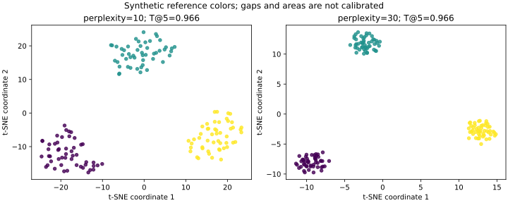

# t-SNE：二维图能帮你观察什么，不能证明什么

## 把高维邻居关系画出来

一条文本Embedding可能有上千个维度，无法直接画散点图。t-SNE尝试把样本放到二维或三维，让原空间相近的样本在图中仍较可能成为邻居。它的主要用途是探索和可视化，而不是自动生成业务类别。

与[PCA](03-pca-and-information-loss.md)不同，PCA寻找线性方向并保留较多方差；t-SNE优化高维与低维的邻居概率关系。与[谱聚类](05-spectral-clustering.md)也不同：t-SNE本身不输出簇标签。图上出现三个小岛，不能直接得出“存在三个真实类别”。

## 从距离变成概率

在高维空间里，以点i为中心，根据到其他点的距离构造条件概率：

$$p_{j|i}=\frac{\exp(-\|x_i-x_j\|^2/(2\sigma_i^2))}{\sum_{k\ne i}\exp(-\|x_i-x_k\|^2/(2\sigma_i^2))}.$$

每个点有自己的带宽σ_i，而不是所有点共用一个固定半径。条件概率经过对称化得到p_ij。低维中的q_ij使用重尾的Student-t形式，常见二维设定与`(1+||y_i-y_j||²)⁻¹`成比例，再归一化。

目标是减小：

$$KL(P\|Q)=\sum_{i\ne j}p_{ij}\ln\frac{p_{ij}}{q_{ij}}.$$

当高维中本来很近的点被低维放得很远，通常会受到明显惩罚；但这不表示所有远点之间的距离都被等比例保留。重尾分布缓解许多邻居拥挤在中心的问题，仍无法把高维几何无损放进二维。目标非凸，不同初始化可能得到不同局部解。

## Perplexity不是簇的数量

Perplexity由条件分布的熵决定：`2^H`，这里H使用以2为底的熵。若一个点平均把概率分给10个邻居，perplexity约10；若概率更集中，有效邻居数更少。它是邻域尺度的直觉，不是严格只取k个近邻，也不是预设类别数。

较小值更强调细局部结构，较大值倾向考虑更多邻居；需要结合样本数、密度和噪声观察。在scikit-learn中它必须小于样本数，不能给20个样本照搬默认30。改变perplexity也改变了高维概率P，因此不同perplexity的最终KL值不能简单用来排名“哪个图更正确”。

## 五种最容易误读的图形

| 看到的现象 | 不宜直接推断 | 进一步检查 |
| --- | --- | --- |
| 两个岛离得很远 | 两类在业务上差异巨大 | 原空间距离、代表样本和领域定义 |
| 一个岛面积更大 | 这一类原始分布更分散 | 原空间方差、密度与带宽 |
| 空白间隔明显 | 一定存在真实类别边界 | 参数、抽样、其他表示下是否稳定 |
| 颜色混在一起 | 任何模型都无法区分类别 | 二维压缩损失、原空间监督评估 |
| 换种子后岛的位置变化 | 数据发生漂移 | 先排除坐标旋转、布局与优化差异 |

颜色常来自已有标签或人工注释。必须说明颜色来源，不能先把图上的岛人工命名，再把这些颜色作为算法正确的证明。画出的稀疏区域也未必是稀有事件：抽样方式和非线性布局都会影响视觉密度。

## 参数、初始化和输入契约

scikit-learn当前示例使用`max_iter`，旧示例的`n_iter`不能无条件照搬。优化包含early exaggeration阶段，它改变早期吸引作用，不是业务类别的置信度。迭代预算要覆盖后续优化；只运行到早期阶段不能当作稳定最终图。

该库`learning_rate='auto'`按`max(N / early_exaggeration / 4, 50)`设置。其他t-SNE实现可能采用不同学习率尺度，数字相同不保证配置相同。`init='pca'`通常帮助布局稳定，但不会保证完整保留全局结构，也不把t-SNE变成线性方法。

特征很多时，可先用PCA或稀疏数据的TruncatedSVD减小维度，记录降维维数与信息损失；原始度量、归一化、去重和抽样都需固定。`metric='precomputed'`接受距离矩阵，与谱聚类`affinity='precomputed'`接受相似矩阵的语义不同；PCA初始化不能直接用于预计算距离模式。

## 如何量化局部关系

Trustworthiness检查二维里出现的近邻，在高维里是否原本也靠近：若某个低维近邻在高维排名很远，会受到较大惩罚。分数范围0到1，要记录邻居数k和原空间距离度量；scikit-learn要求k小于样本数的一半。

高分不证明二维图的全局距离、簇数量或业务分类准确。它主要惩罚“新增的错误近邻”，不能单独完整描述原邻居被丢失的情况；可再检查邻居保留率或其他互补指标。对二维坐标做整体平移或正比例缩放，近邻次序不变，trustworthiness也应保持不变，所以坐标数值的绝对大小不具有统一业务单位。

## 新样本与生产限制

这版scikit-learn TSNE没有通用transform接口。重新加入样本并运行，原有点的坐标也可能改变。不能直接把每小时重跑的两张图按绝对坐标相减，就宣称发现了数据漂移。

如果需要稳定的在线特征、分类或检索，应另外设计可对新数据转换的模型与版本契约；研究中的参数化扩展或其他库的新点嵌入能力，也不能自动视为这个API具备。Barnes-Hut梯度近似比exact通常更省计算，仍需邻居构造、内存与优化成本；它不是对任意大数据都无条件可用。

## 已运行的对照图

两幅图使用同一150条、8维合成数据，颜色表示数据生成时的参考类别，不参与t-SNE拟合。perplexity分别10和30；初始化PCA、随机种子0、最大迭代500，学习率auto。图的坐标范围分别自动设置，不能拿视觉面积直接比较原始密度。

[实验脚本](examples/tsne_checks.py)实际调用scikit-learn，核对输出形状与有限性、perplexity边界、无transform接口，以及整体平移和缩放不改变trustworthiness。两种设置的T@5分别约0.966009和0.966207；KL分别约0.608849和0.224198。由于P随perplexity改变，较小KL不是后者一定更优的证据。

执行日期2026-10-04；Python 3.12.14、NumPy 2.3.5、scikit-learn 1.8.0，退出码0，无stderr。运行：`python knowledge/unsupervised-learning/examples/tsne_checks.py`。加`--plot`可导出图，需要额外安装matplotlib。实验未测实际文本Embedding、多随机初始化、预计算距离模式、生产规模或业务质量，不要求所有数据都有漂亮的岛。

练习：图上A岛距离B岛是C岛距离B岛的两倍，能否据此给A与B的业务差异打两倍分？不能，局部概率嵌入没有这种全局比例保证。

## 开源来源与许可

核验日期2026-10-04。已实际读取scikit-learn官方manifold.rst的t-SNE章节，以及_t_sne.py中的TSNE和trustworthiness约定。中文解释、实验与图独立编写，不复制上游实现。固定链接见[专题来源记录](README.md)，BSD-3-Clause许可及版权与该专题一致。来源快照与本地安装版本不同，本轮仅核验已运行的案例。

[返回专题目录](README.md)
